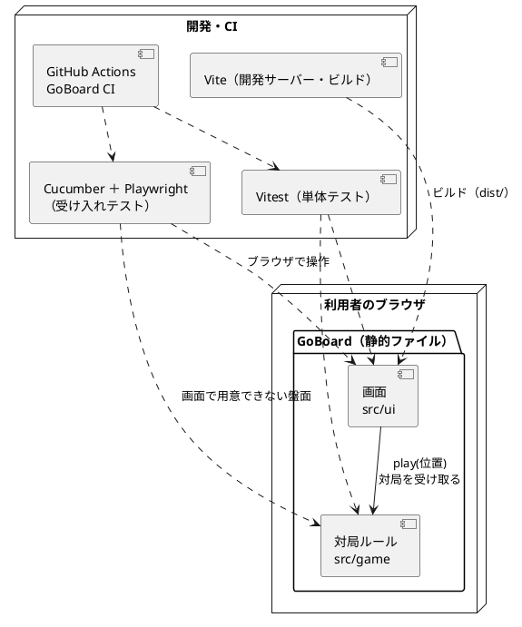
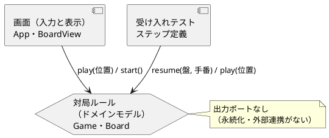

# GoBoard アーキテクチャ設計

GoBoard のアプリケーション・フロントエンド・インフラストラクチャのアーキテクチャです。v0.1.0 の実装と、[ADR 0001](../../adr/goboard/0001-TypeScriptとReactによるWebアプリにする.md)（TypeScript と React による Web アプリ）・[ADR 0002](../../adr/goboard/0002-CucumberとPlaywrightで受け入れテストを書く.md)（Cucumber と Playwright の受け入れテスト）から書き起こし、[アーキテクチャ設計ガイド](../../reference/アーキテクチャ設計ガイド.md)の選択フローに当てはめて妥当性を確かめます。決定そのものは ADR にあり、本書は構成と理由をまとめます。

## 全体構成

GoBoard は、1 台のブラウザの中で完結する Web アプリです。サーバー・API・データベースはありません。ルール（対局ルール）もブラウザの中で動きます。



| 構成要素 | 責務 | 実装 |
| :--- | :--- | :--- |
| 対局ルール | 盤と着手・手番・勝敗判定（R1〜R10） | `apps/goboard/src/game/` |
| 画面 | 盤・手番・結果・置けない理由の表示と、マスのクリック | `apps/goboard/src/ui/` |
| 受け入れテスト | 受入条件（日本語 Gherkin）をブラウザとルールで検証する | `apps/goboard/features/` |

依存の向きは「画面 → 対局ルール」の一方向で、対局ルールは React や DOM に依存しません（`src/game/` に `react` や DOM の import はありません）。

## アプリケーションアーキテクチャ（バックエンドに相当）

### 選択フローへの当てはめ

GoBoard にはバックエンドがありません。ただし、ガイドの「バックエンドアーキテクチャ」は業務ロジックの置き方の選択なので、ブラウザの中の対局ルールに当てはめます。

| 判断基準 | GoBoard | 根拠 |
| :--- | :--- | :--- |
| 業務領域のカテゴリー | 中核 | プロダクトオーナーが定めた独自のルールそのものが価値（[ドメインモデル](./domain-model.md)の戦略的分類） |
| 金額・分析・監査記録 | なし | 対局を保存しない（仮定 A2） |
| 永続化モデル | なし（0） | データベースもブラウザの保存もない |
| 選ばれるパターン | ドメインモデル ＋ ピラミッド形のテスト | ガイドの選択フロー |

ガイドの選択フローは、「中核・監査なし・永続化モデルが単一」の場合にポートとアダプターを選ぶ流れです。GoBoard は永続化も外部連携もないため、出力ポート（リポジトリ・外部 API）が要りません。そこで、次の単純な形にしています。



- **ドメインモデル**：ルールは `Game`（集約ルート）と `Board`（値オブジェクト）に集め、どちらも不変にしています。置いた結果は新しい対局として返します（[ドメインモデル](./domain-model.md)）。
- **入力の窓口**：`Game.start()`・`Game.resume()`・`Game.play()` の 3 つだけです。画面と受け入れテストは、この窓口だけを使います。
- **アプリケーションサービスを置かない理由**：画面が 1 つの対局を持ち、`play` の結果をそのまま表示するだけで、トランザクションや DTO の変換がないためです。

### テストの形

| 層 | 道具 | 件数（v0.1.0） | 対象 |
| :--- | :--- | ---: | :--- |
| ルールの単体テスト | Vitest | 63 | 受入条件の境界（4 方向、盤の端、R9 の組み合わせなど）を速く網羅する |
| 画面のコンポーネントテスト | Vitest ＋ Testing Library（jsdom） | 16 | クリックから表示までの振る舞い |
| 受け入れテスト | Cucumber ＋ Playwright（Chromium） | 60 シナリオ | ストーリー S01〜S12 の受入条件を、ブラウザとルールで検証する |

単体テストが土台のピラミッド形ですが、受け入れテストも厚めです。受入条件を 1 件ずつシナリオにしているためです（ADR 0002）。画面から用意できない盤面は、受け入れテストでもルールに対して直接確かめ、ブラウザで操作するシナリオは必要なものに絞っています。

## フロントエンドアーキテクチャ

### 選択フローへの当てはめ

| 決定ポイント | GoBoard の選択 | 理由 |
| :--- | :--- | :--- |
| プロジェクト規模 | 小規模。ただし、フォルダはコンテキストで分ける | 下の「プロジェクト構成」を参照 |
| レンダリング戦略 | SPA（クライアントサイドのみ） | SEO は不要。1 画面のインタラクティブなアプリ |
| 状態管理 | React の `useState` だけ | 状態は「現在の対局」と「置けない理由の文言」の 2 つで、共有もない |
| スタイル | 素の CSS（`BoardView.css`） | 盤のマス目を固定幅にするだけで、CSS-in-JS は要らない |
| フレームワーク | React 19 ＋ Vite 8 | ADR 0001（プロダクトオーナーが選択） |

### プロジェクト構成

```text
apps/goboard/
├── index.html               # タイトル「GoBoard」、エントリーポイント
├── src/
│   ├── main.tsx             # React の起動
│   ├── game/                # 対局ルール（React・DOM に依存しない）
│   │   ├── board.ts         # 盤・マス・駒・位置・向き
│   │   ├── game.ts          # 対局（集約ルート）と着手の判定
│   │   ├── index.ts         # 公開する窓口
│   │   └── testing/boards.ts# テスト用の盤面（本番の画面からは使わない）
│   ├── ui/                  # 画面
│   │   ├── App.tsx          # 対局画面（状態を持つ）
│   │   ├── BoardView.tsx    # 盤（表示とクリックの受け付けだけ）
│   │   ├── BoardView.css
│   │   └── labels.ts        # 表示の文言（駒の記号・読み上げ名・理由・状態）
│   └── test/setup.ts        # jest-dom の読み込み
├── features/                # 受け入れテスト（日本語 Gherkin・ステップ定義・サポート）
├── cucumber.mjs
├── vite.config.ts           # Vite と Vitest の設定
└── tsconfig.json            # strict・noUncheckedIndexedAccess
```

ガイドの小規模向けの構成（`components/`・`pages/`・`hooks/`…）ではなく、境界付けられたコンテキストで `game/` と `ui/` に分けています。ルールと画面の依存の向きを、フォルダの境界で見えるようにするためです。画面の部品が増えたら、`ui/` の中で分けます。

### コンポーネント設計

| コンポーネント | 役割 | 状態 |
| :--- | :--- | :--- |
| `App` | 対局を持ち、クリックを `game.play` に渡し、結果（新しい対局・置けない理由）を状態にする | あり（`useState`） |
| `BoardView` | 盤を 15 × 15 のボタンで表示し、クリックされた位置を `onSelect` で返す | なし |
| `labels` | 表示の文言を 1 か所に集める（関数） | なし |

ガイドの Container と Presentational の分け方にあたり、`App` が Container、`BoardView` が Presentational です。ルールの判断はどちらにもなく、`Game` だけが判断します。

## インフラストラクチャアーキテクチャ

### 現在の構成

| 項目 | 現在 |
| :--- | :--- |
| 実行環境 | 利用者のブラウザ。`npm run build` で `dist/` に静的ファイル（HTML と JavaScript 約 223 kB、gzip 後 約 70 kB）を作る |
| 配信先 | 未定（デプロイしていない） |
| CI | GitHub Actions の GoBoard CI（`.github/workflows/goboard-ci.yml`）。`apps/goboard/` の変更の push と Pull Request で、型チェック → 単体テスト → ビルド → Chromium のインストール → 受け入れテスト |
| 開発環境 | Node.js 22。受け入れテスト用の Chromium は `npm run test:acceptance:setup` で入れる（Playwright は 1.56.1 に固定。ADR 0002） |
| リリース | Git のタグ（`v0.1.0`）。バージョンは `apps/goboard/package.json`、変更履歴は `apps/goboard/CHANGELOG.md` |

### 選択フローへの当てはめ

サーバーがないため、ガイドのデプロイメントパターン（モノリシック・マイクロサービス・コンテナ・サーバーレス）のどれにも当たりません。静的ファイルを配信するだけなので、配信するなら静的ホスティング（CDN）が最も単純です。データを持たないので、バックアップ・災害復旧・データベースの監視は要りません。

### 気づいた点（要判断）

| No. | 気づいた点 | 影響 | 候補 |
| :--- | :--- | :--- | :--- |
| F1 | GoBoard の配信先が決まっていない | 利用者に届ける手段がない（手元で `npm run dev` を実行する必要がある） | 静的ホスティング（例：GitHub Pages）に `dist/` を配信する。本番環境の追加なので、プロダクトオーナーの判断が要る |
| F2 | `docker-publish.yml` はすべてのタグの push で動く。v0.1.0 のタグで、GoBoard ではなくリポジトリの開発環境（Ubuntu ベースのイメージ）が GitHub Container Registry に `v0.1.0` として公開された（2026-09-26 09:44 UTC の実行、成功） | タグの意味が 2 つに分かれる（GoBoard のリリースと開発環境のイメージ） | GoBoard のタグの付け方を分ける（例：`goboard-v0.1.0`）か、`docker-publish.yml` の対象タグを絞る。外部に公開される設定なので、プロダクトオーナーの判断が要る |
| F3 | 受け入れテストは Chromium だけ | Firefox・Safari での見た目と動作が未確認（リスク K1） | CI で Firefox・WebKit も実行するか、手元で確かめる |

## 品質属性

| 品質属性 | 実現方法 |
| :--- | :--- |
| 変更容易性 | ルールと画面の分離（依存の向き）。表示の文言は `labels.ts`、ルールの定数は `game.ts` の 1 か所 |
| テスト容易性 | 対局ルールは React・DOM に依存しない不変のオブジェクト。`Game.resume` で任意の盤面から検証できる |
| 正しさ | 受入条件を 1 件ずつ自動テストにし、各 Bolt で実装を壊してテストが失敗することを確かめた |
| 性能 | 1 手ごとに最大 225 マス × 4 方向で置けるマスを探す（R10）。ブラウザで体感できる遅れはない（受け入れテストで 225 手を打ち切っても数秒） |
| 可用性・セキュリティ | サーバー・利用者の入力データ・認証がないため、対象外。入力はマスのクリックだけ |

## 関連する決定

| 決定 | 記録 |
| :--- | :--- |
| TypeScript・React・Vite の Web アプリ、サーバーなし、`src/game` と `src/ui` の分離 | [ADR 0001](../../adr/goboard/0001-TypeScriptとReactによるWebアプリにする.md) |
| 受入条件を日本語 Gherkin にし、Cucumber と Playwright で検証。Playwright の固定と CI | [ADR 0002](../../adr/goboard/0002-CucumberとPlaywrightで受け入れテストを書く.md) |
| R9 を盤ではなく対局で判定、対局を不変にする、など | [ドメインモデル](./domain-model.md)「設計上の判断」 |

F1・F2 を決めたら、新しい ADR に記録します。
