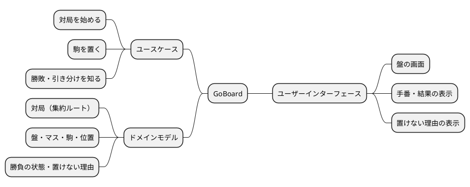
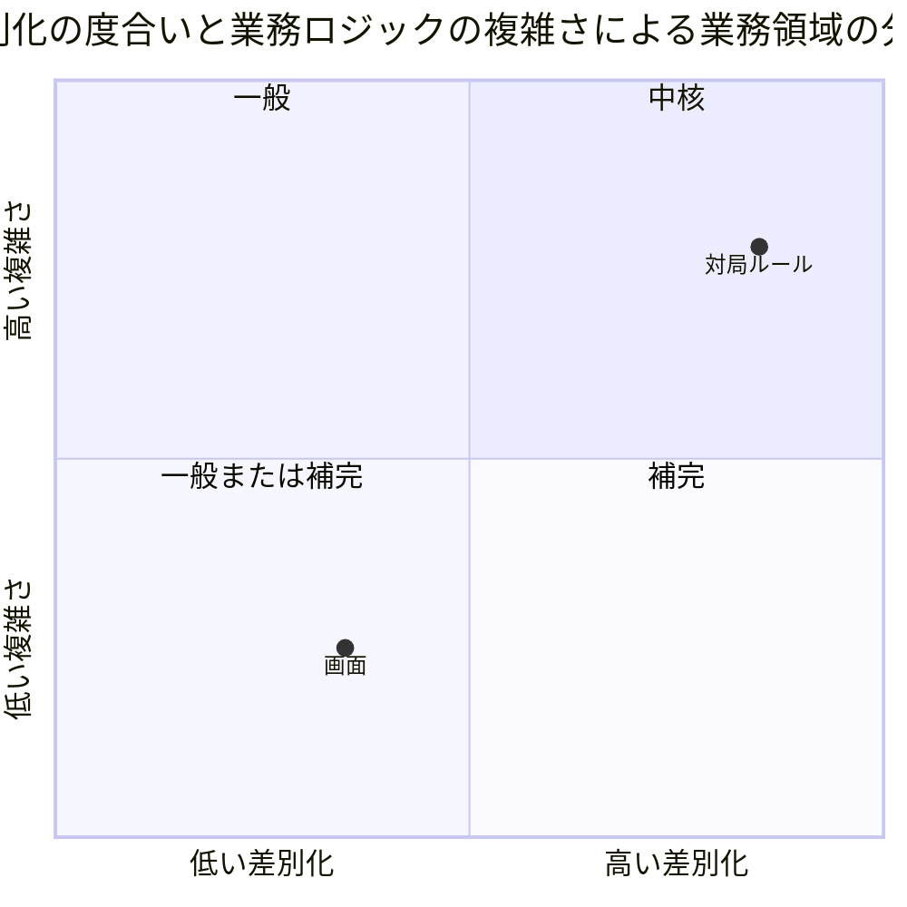
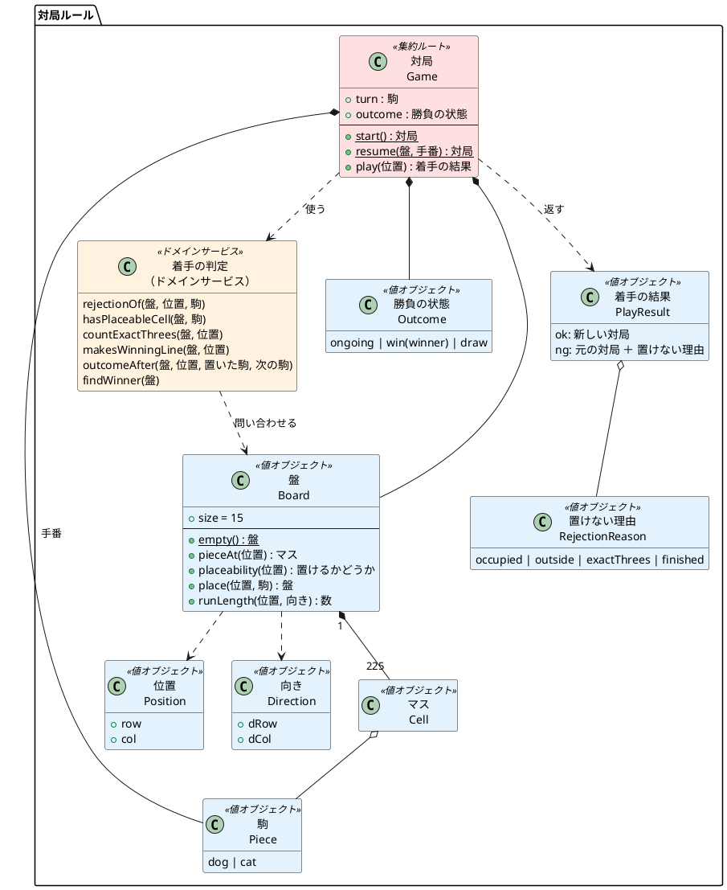
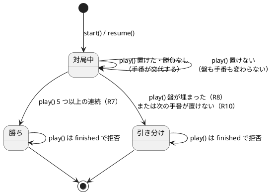
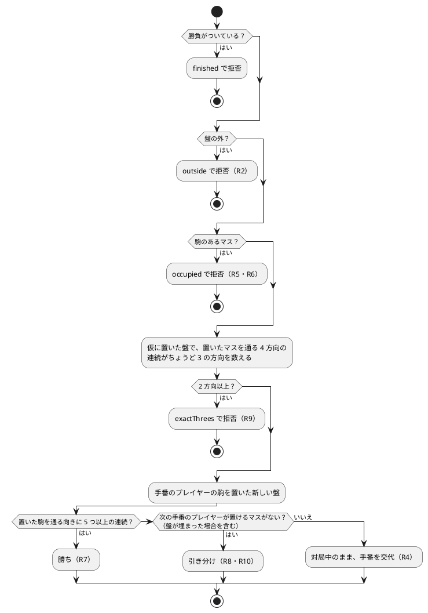

# GoBoard ドメインモデル

GoBoard のルール（`apps/goboard/src/game/`）を、DDD の戦術的設計パターンで表したドメインモデルです。v0.1.0 の実装とテストが先にあるため、コードからモデルを書き起こし（ブラウンフィールドの静的モデル）、モデルとコードの対応と、設計上の判断を記録します。

ルールの唯一の正解は [ルール定義](../../requirements/goboard/ルール定義.md) です。本書の用語・不変条件はすべてルール番号（R1〜R10）にトレースします。

## 概要

### 境界付けられたコンテキスト

| コンテキスト | 責務 | 実装 | Unit |
| :--- | :--- | :--- | :--- |
| 対局ルール | 盤と着手・手番・勝敗判定。ルール R1〜R10 のすべて | `src/game/` | U1・U2・U3 |
| 画面 | 盤・手番・結果・置けない理由の表示と、マスのクリックの受け付け | `src/ui/` | U4 |

依存の向きは「画面 → 対局ルール」の一方向です。対局ルールは React や DOM に依存しません（[ADR 0001](../../adr/goboard/0001-TypeScriptとReactによるWebアプリにする.md)）。画面は対局ルールの結果を表示するだけで、ルールの判断をしません。

- **対局ルール（中核）**：プロダクトオーナーが定めた独自のルール（犬と猫、5 つ以上で勝ち、ちょうど 3 つの並びの制限、置けるマスがなければ引き分け）そのものが GoBoard の価値です。R9・R10 の判定は、4 方向の連続と置く前後の盤を組み合わせるため、複雑さも高くなります。
- **画面（一般または補完）**：盤をマス目で表示し、クリックを受け付けるだけの一般的な作りです。

## ユビキタス言語

GoBoard の用語集はこの節だけです（ルール定義からもここを参照します）。コード・画面・ドキュメント・テストの名前は、この用語集に合わせます。既存ゲームの用語は使いません（`CLAUDE.md` のガードレール）。用語を足したり変えたりするときは、この表を先に直します。

| 用語 | コード上の名前 | 種類 | 意味 | ルール |
| :--- | :--- | :--- | :--- | :--- |
| GoBoard | なし（画面の見出し・ドキュメントでの呼び名） | ゲームの名前 | このゲームの名前。コードの識別子には使わない | — |
| 対局 | `Game` | 集約ルート | 盤と手番と勝負の状態を持つ 1 回のゲーム | R4・R5・R7〜R10 |
| 盤 | `Board` | 値オブジェクト | 縦 15 × 横 15 のマス目と、そこに置かれた駒 | R2・R6 |
| マス | `Cell` | 値オブジェクト | 盤の 1 区画の状態。駒の種類か、空いている（`null`） | R2 |
| 駒 | `Piece` | 値オブジェクト | マスに置くもの。種類は犬か猫 | R3 |
| 犬・猫 | `'dog'` / `'cat'`（`Piece` の値） | 値 | 駒の種類。どちらかのプレイヤーが受け持つ。先手は犬 | R3・R4 |
| プレイヤー | なし（手番の駒の種類で表す） | — | 犬か猫のどちらかを受け持つ人。画面では「犬の手番」のように、受け持つ駒の種類で呼ぶ | R1 |
| 位置 | `Position` | 値オブジェクト | 行と列（どちらも 1 始まり）の組 | R2 |
| 向き | `Direction`・`DIRECTIONS` | 値オブジェクト | 並びの方向。横・縦・右下がり・右上がりの 4 つ | R7・R9 |
| 手番 | `Game.turn` | 対局の属性 | 次に駒を置くプレイヤーが受け持つ駒の種類 | R4 |
| 連続 | `Board.runLength` | 盤の問い合わせ | 同じ種類の駒が、ある向きにあいだを空けずに続く数 | R7・R9 |
| ちょうど 3 つの並び | `EXACT_THREE_LENGTH` | 定数 | 連続がちょうど 3 の並び。両隣に同じ種類の駒はない | R9 |
| 勝負の状態 | `Outcome` | 値オブジェクト | 対局中（`ongoing`）・勝ち（`win`）・引き分け（`draw`） | R7・R8・R10 |
| 置けるかどうか | `Placeability` | 値オブジェクト | 盤から見た置けるかどうか（`ok`・`occupied`・`outside`） | R2・R5・R6 |
| 置けない理由 | `RejectionReason` | 値オブジェクト | 対局から見た置けない理由（`occupied`・`outside`・`exactThrees`・`finished`） | R2・R5・R6・R9 |
| 着手の結果 | `PlayResult` | 値オブジェクト | 駒を置こうとした結果。置けたら新しい対局、置けなければ元の対局と理由 | R5 |

## 値オブジェクト

どの値オブジェクトも不変（`readonly`）で、属性が同じなら同じものとして扱います。

| 値オブジェクト | 属性 | 生成時の制約・振る舞い |
| :--- | :--- | :--- |
| 駒 `Piece` | `'dog' \| 'cat'` | 型で 2 種類に限定する |
| 位置 `Position` | `row`・`col` | 生成時には検証しない（盤の外の位置も値として表せる。下の「設計上の判断」を参照） |
| 向き `Direction` | `dRow`・`dCol` | 使うのは `DIRECTIONS` の 4 つだけ |
| マス `Cell` | `Piece \| null` | `null` は空いているマス |
| 勝負の状態 `Outcome` | `kind`（`win` のときは `winner`） | 判別可能な共用体。勝ちのときだけ勝者を持つ |
| 置けない理由 `RejectionReason` | 4 種類の文字列 | 画面は理由ごとの文言を表示する（`ui/labels.ts`） |
| 盤 `Board` | 225 個のマス | 下で詳しく述べる |

### 盤 `Board`

盤は識別子を持たず、同じ駒の配置なら同じ盤です。駒を置くと、元の盤は変えずに新しい盤を返します。

| 振る舞い | 内容 | ルール |
| :--- | :--- | :--- |
| `Board.empty()` | すべてのマスが空いている盤を作る（ファクトリ） | R2 |
| `pieceAt(位置)` | マスの駒を返す。盤の外なら空いているマス扱い（`null`） | R2 |
| `placeability(位置)` | 盤から見て置けるか（盤の外・駒のあるマス） | R2・R5・R6 |
| `place(位置, 駒)` | 駒を置いた新しい盤を返す。置けないマスなら例外 | R5・R6 |
| `runLength(位置, 向き)` | そのマスを通る向きの軸で、同じ種類の駒の連続を前後両方向に数える | R7・R9 |

盤が自分で守る不変条件は「盤の中にしか駒がない」「一度置いた駒は変わらない」の 2 つだけです。R9 のような「手のルール」は盤では判定しません（対局が判定します）。

## エンティティと集約

### 対局 `Game`（集約ルート）

対局は、始まってから勝負がつくまでのライフサイクルを持つため、概念上はエンティティです。集約の中身は、盤・手番・勝負の状態です。盤・手番・勝負の状態は、外から直接変えることはできません。変える方法は、集約ルートの `play` だけです。

### 不変条件

| No. | 不変条件 | ルール | 守る場所 |
| :--- | :--- | :--- | :--- |
| I1 | 駒は盤の中のマスにしかない | R2 | `Board.place`（盤の外なら例外） |
| I2 | 一度置いた駒は、動かず取り除かれない | R6 | `Board`（不変。`place` は駒のあるマスなら例外） |
| I3 | 置けるのは手番のプレイヤーの駒だけで、1 回に 1 つ | R4・R5 | `Game.play`（置く駒は常に `turn`） |
| I4 | 置けたら手番が相手に移り、置けなければ盤も手番も変わらない（パスはない） | R4・R5 | `Game.play` |
| I5 | ちょうど 3 つの並びを同時に 2 か所以上作るマスには置けない。この判定は勝ちより先 | R9 | `Game.play` → `rejectionOf` |
| I6 | 置いた駒を通る向きに 5 つ以上の連続ができたら、その駒の種類の勝ち | R7・R8 | `Game.play` → `outcomeAfter` |
| I7 | 勝ちがなく、盤が埋まるか次の手番のプレイヤーが置けるマスがなければ引き分け | R8・R10 | `Game.play` → `outcomeAfter`・`Game.resume` |
| I8 | 勝負がついたら、それ以上は置けない | R7・R8・R10 | `Game.play`（理由 `finished`） |

### 勝負の状態の遷移

### 着手の判定の順序（`Game.play`）

R9 は勝ちより先に判定するため、5 つ並ぶマスでも、ちょうど 3 つの並びが 2 か所以上できるなら置けません（ルール定義「R9 の詳細」）。

## ドメインサービス

エンティティにも値オブジェクトにも属さず、盤と駒と位置を組み合わせて答える判定です。どれも状態を持たない関数で、現在は `src/game/game.ts` の中の非公開関数として実装しています。

| サービス（関数） | 答えること | ルール |
| :--- | :--- | :--- |
| 置けない理由を判定する（`rejectionOf`） | その駒をそのマスに置けない理由。盤の外・駒のあるマス → R9 の順 | R2・R5・R6・R9 |
| ちょうど 3 つの並びを数える（`countExactThrees`） | 置いたマスを通る 4 方向のうち、連続がちょうど 3 の方向の数 | R9 |
| 置けるマスがあるか判定する（`hasPlaceableCell`） | その駒を置けるマスが 1 つでもあるか（`rejectionOf` と同じ基準） | R8・R10 |
| 勝ちの並びか判定する（`makesWinningLine`） | 置いたマスを通るどれかの向きに 5 つ以上の連続があるか | R7 |
| 置いたあとの勝負を判定する（`outcomeAfter`） | 勝ち → 盤の埋まり・置けるマスの有無、の順に勝負の状態を決める | R7・R8・R10 |
| 勝者を探す（`findWinner`） | 盤全体から 5 つ以上の連続がある駒の種類（再開時に使う） | R7 |

`rejectionOf` を `play` と `hasPlaceableCell` で共有しているのは、「置けるかどうか」の基準が 1 つであることを構造で保証するためです。R10（置けるマスがない）が R9 と食い違うことはありません。

## ファクトリ

| ファクトリ | 作るもの |
| :--- | :--- |
| `Board.empty()` | すべて空いている盤 |
| `Game.start()` | 空の盤・犬の手番・対局中の対局（R4） |
| `Game.resume(盤, 手番)` | 途中の盤面から再開した対局。勝ち → 引き分け（盤の埋まり・置けるマスがない）→ 対局中の順に勝負の状態を決める |

`Game.resume` は、画面から到達しにくい盤面（最後の 1 マスで勝つ、置けるマスがなくなる）を、テストで用意するためにも使います（`src/game/testing/boards.ts`）。

## リポジトリ

ありません。対局は保存せず、ページを再読み込みすると最初からやり直しになります（仮定 A2）。対局を保存する必要が出たら、`Game` の集約ごとにリポジトリを置きます。

## 設計上の判断

| 判断 | 理由 | 代わりの案と、選ばなかった理由 |
| :--- | :--- | :--- |
| 対局は識別子を持たない | 1 つの画面に対局は 1 つだけで、ほかの対局と区別する必要がない | `GameId` を持たせる案。オンライン対戦や保存（ADR 0001 の将来）の段階で導入する |
| 対局と盤は不変。`play` は新しい対局を返す | 置く前の状態が書き換わらないことを構造で保証でき（I2・I4）、画面は受け取った対局を表示するだけで済む | 対局を可変にして状態を書き換える案。置けなかったときの巻き戻しが要る |
| 位置は生成時に検証しない | 「盤の外を指定して置こうとする」（S04）を値として表し、`outside` で拒否するため | 生成時に盤の範囲で検証する案。盤の外を表せず、S04 の受入条件を書けない |
| R9 は盤ではなく対局で判定する | R9 は「手のルール」で、盤の不変条件ではない。盤で判定すると、テストの盤面（フィクスチャ）すら作れなくなる | `Board.place` で R9 を判定する案（Bolt 4 で検討し、不採用） |
| ドメインサービスを非公開の関数にしている | 使うのは `Game` だけで、外に公開する必要がない | 独立したモジュール（例：`rules.ts`）に分ける案。ルールが増えて `game.ts` が大きくなったら分ける |
| 置けなかったときは例外ではなく結果（`PlayResult`）で返す | 置けないことはゲームの中の普通の出来事で、画面は理由を表示するだけでよい | 例外を投げる案。画面で例外を受け止める必要があり、理由の種類を型で網羅できない |

## トレーサビリティ

| ルール | モデルの要素 | 受け入れテスト |
| :--- | :--- | :--- |
| R1 2 人で対戦する | 対局の手番（犬・猫） | S05・S09 |
| R2 盤は 15 × 15 | `Board`・`BOARD_SIZE`・`Placeability.outside` | S01・S04 |
| R3 駒は犬と猫 | `Piece` | S02・S05 |
| R4 先手は犬、交互 | `Game.start`・`Game.play`（I3・I4） | S05 |
| R5 空いているマスに 1 つ、パスなし | `Game.play`・`Placeability.occupied`（I3・I4） | S02・S03・S09 |
| R6 駒は動かず取り除かれない | `Board`（不変、I2） | S03・S07 |
| R7 5 つ以上連続で勝ち | `Board.runLength`・`makesWinningLine`・`Outcome.win`（I6） | S06・S07・S10 |
| R8 置いたあとに判定、盤が埋まれば引き分け | `outcomeAfter`・`hasPlaceableCell`・`Outcome.draw`（I6・I7） | S07・S08・S10 |
| R9 ちょうど 3 つの並びを 2 か所以上作るマスには置けない | `countExactThrees`・`rejectionOf`・`RejectionReason.exactThrees`（I5） | S11 |
| R10 置けるマスがなければ引き分け | `hasPlaceableCell`・`outcomeAfter`・`Game.resume`（I7） | S12 |

## 改訂履歴

| 日付 | 内容 |
| :--- | :--- |
| 2026-09-26 | 初版（v0.1.0 のコードから書き起こし） |
| 2026-09-26 | 用語集をこの節に一本化し（ルール定義の用語集を移した）、GoBoard・犬と猫・プレイヤーの 3 語を追加。コード上の名前はコードに合わせた（設計整合性の検証 B3・B4） |
