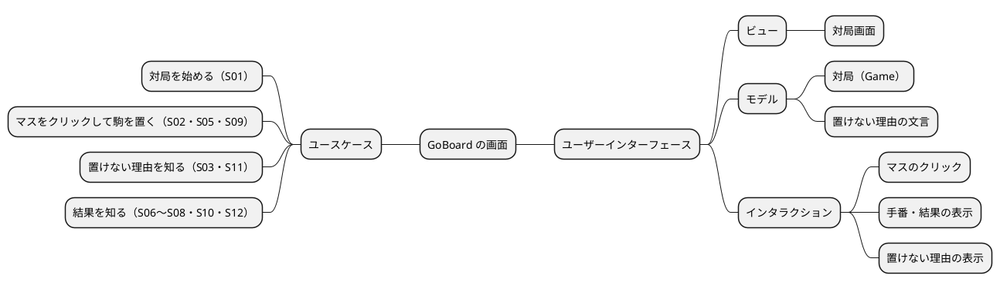
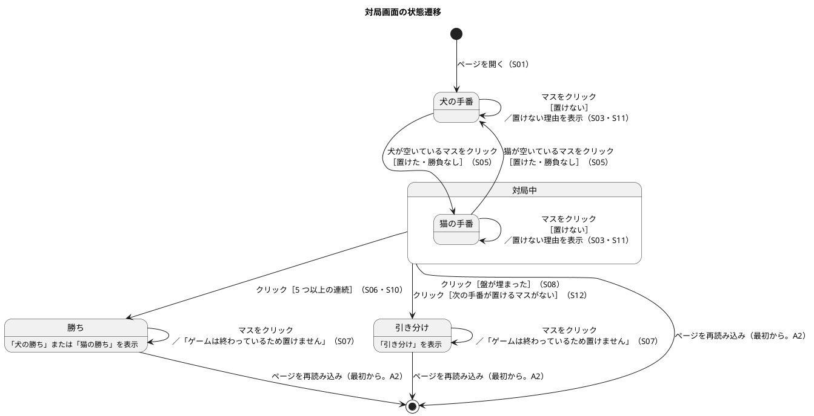
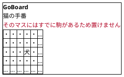
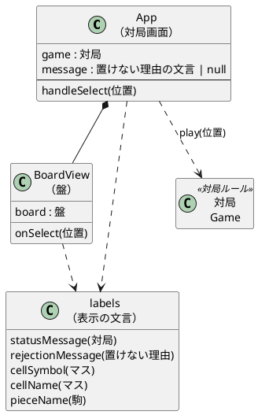

# GoBoard UI 設計

GoBoard の画面（`apps/goboard/src/ui/`）の UI 設計です。v0.1.0 の実装とテストが先にあるため、コードから画面一覧・画面遷移・画面イメージ・インタラクションを書き起こし、ユーザーストーリー（S01〜S12）と対応づけます。ルールの判断は画面ではなく対局ルールが行います（[ドメインモデル](./domain-model.md)）。

## 概要

## 画面のオブジェクト（OOUI）

利用者が画面で扱う「モノ」は、ドメインモデルの用語と同じです。

| オブジェクト | 見えるもの | 利用者のアクション | ドメインモデル |
| :--- | :--- | :--- | :--- |
| 盤 | 15 × 15 のマス目 | 見る | `Board` |
| マス | 空き（`・`）・犬（🐶）・猫（🐱） | クリックして駒を置く | `Cell`・`Position` |
| 対局 | 手番（「犬の手番」）または結果（「犬の勝ち」「引き分け」） | 見る | `Game`・`Outcome` |
| 置けない理由 | 置けなかったときの文言 | 見る | `RejectionReason` |

アクションは「マスをクリックする」の 1 つだけです。作成・編集・削除（CRUD）の操作はなく、パス・やり直し・もう 1 局の操作もありません（ルール定義にないため。仮定 A3）。

## 画面一覧

| 画面 | 目的 | 見るもの | 操作 | ストーリー |
| :--- | :--- | :--- | :--- | :--- |
| 対局画面 | 最初の手から勝敗・引き分けまで遊ぶ | 「GoBoard」の見出し、手番または結果、置けない理由、盤 | マスのクリック | S01〜S12 |

画面は 1 つだけです。ページの遷移やナビゲーションはなく、対局の状態によって、同じ画面の表示が変わります。ページを再読み込みすると、対局は最初からやり直しになります（仮定 A2）。

## 画面遷移図

1 つの画面の中の状態の遷移です。遷移の条件は、マスのクリックに対する対局ルールの結果です。

置けない理由の表示は、次に駒を置けたときに消えます。勝負がついたあとに出た理由の表示は、そのまま残ります。

## 画面イメージ

盤は 15 × 15 ですが、図では左上の一部だけを描き、残りを「…」で省略しています。

### 開いた直後（S01）

```plantuml
@startsalt
{+
  <b>GoBoard
  犬の手番
  {#
    ・ | ・ | ・ | ・ | ・ | …
    ・ | ・ | ・ | ・ | ・ | …
    ・ | ・ | ・ | ・ | ・ | …
    ・ | ・ | ・ | ・ | ・ | …
    … | … | … | … | … | …
  }
}
@endsalt
```

### 置けなかったとき（S03・S09・S11）

### 勝負がついたとき（S07・S10）

```plantuml
@startsalt
{+
  <b>GoBoard
  犬の勝ち
  {#
    ・ | ・ | ・ | ・ | ・ | …
    犬 | 犬 | 犬 | 犬 | 犬 | …
    猫 | 猫 | 猫 | 猫 | ・ | …
    ・ | ・ | ・ | ・ | ・ | …
    … | … | … | … | … | …
  }
}
@endsalt
```

salt 図では絵文字を使えないため「犬」「猫」と書いています。実際の画面では 🐶・🐱 と表示します（ルール定義「表示」）。

### 画面の構成要素

上から次の順に並びます。

| 要素 | 内容 | HTML・ARIA | 実装 |
| :--- | :--- | :--- | :--- |
| 見出し | 「GoBoard」 | `h1` | `App` |
| 状態の表示 | 対局中は「犬の手番」「猫の手番」、勝負がついたら「犬の勝ち」「猫の勝ち」「引き分け」 | `p role="status"` | `App`・`statusMessage` |
| 置けない理由 | 置けなかったときだけ表示する | `p role="alert"` | `App`・`rejectionMessage` |
| 盤 | 15 行 × 15 列のマス。各マスはボタン | `role="grid"`（名前「盤」）・`role="row"`・`role="gridcell"` | `BoardView` |
| マス | 空き `・`・犬 🐶・猫 🐱。読み上げ名は「8 行 8 列 空き」の形 | `button`（`aria-label`） | `BoardView`・`cellSymbol`・`cellName` |

マスの大きさは 36 × 36 px（`2.25rem`）に固定し、絵文字の表示幅でマス目がずれないようにしています（リスク K1）。

## UI のモデル

画面の状態は「現在の対局」と「置けない理由の文言」の 2 つだけです。マスがクリックされると、`App` は `game.play(位置)` を呼び、返ってきた対局をそのまま次の状態にします。置けなかったときは理由の文言を、置けたときは `null`（表示を消す）を設定します。画面の文言はすべて `labels.ts` に集め、表示の変更がルールに影響しないようにしています。

## インタラクション設計

### 主な操作の流れ

| 操作 | 利用者 | 画面の反応 | ストーリー |
| :--- | :--- | :--- | :--- |
| 1. ページを開く | — | 空の盤と「犬の手番」を表示する | S01 |
| 2. 空いているマスをクリックする | 犬のプレイヤー | マスに 🐶 を表示し、「猫の手番」に変える | S02・S05・S09 |
| 3. 空いているマスをクリックする | 猫のプレイヤー | マスに 🐱 を表示し、「犬の手番」に変える | S05 |
| 4. 2・3 を繰り返す | 2 人 | 勝負がついたら「犬の勝ち」「猫の勝ち」「引き分け」を表示する | S06・S08・S10・S12 |

### 置けないときのフィードバック

置けないときは、盤も手番も変えず、置けない理由を状態の表示の下に出します。同じプレイヤーが、そのまま別のマスを選び直せます（パスにはなりません）。

| 状況 | 表示する文言 | ルール | ストーリー |
| :--- | :--- | :--- | :--- |
| 駒のあるマスをクリックした | そのマスにはすでに駒があるため置けません | R5・R6 | S03・S09 |
| ちょうど 3 つの並びが同時に 2 か所以上できるマスをクリックした | ちょうど 3 つの並びが同時に 2 か所以上できるため置けません | R9 | S11 |
| 勝負がついたあとにクリックした | ゲームは終わっているため置けません | R7・R8・R10 | S07・S10 |
| 盤の外を指定した | 盤の外には置けません | R2 | S04（画面からは起こらない） |

サーバーとの通信はないため、通信エラーやタイムアウトはありません。

### キーボードと読み上げ

| 項目 | 現在の振る舞い |
| :--- | :--- |
| キーボード操作 | マスはボタンなので、Tab で移動し、Enter または Space で駒を置ける。フォーカスのあるマスには青い枠を表示する（`:focus-visible`） |
| 読み上げ | マスは「8 行 8 列 空き」「8 行 8 列 犬」のように、位置と状態を読み上げる。手番と結果は `role="status"`、置けない理由は `role="alert"` で読み上げる |
| テスト | 受け入れテストと画面のテストは、この読み上げ名と役割（role）でマスを探す。CSS のクラス名には依存しない（ADR 0002） |

## 改善候補（未実施）

UI を書き起こす中で気づいた点です。ルールに関わるもの、画面の操作を増やすものは、プロダクトオーナーの判断を待ちます。

| No. | 気づいた点 | 候補 | 判断が要る理由 |
| :--- | :--- | :--- | :--- |
| U1 | 盤に `role="grid"` を使っているが、矢印キーでマスを移動できない。Tab で 225 マスを順に移動する必要がある | 矢印キーでマスを移動できるようにする（フォーカスを 1 マスだけに置く） | 操作の追加。キーボード利用者の使い勝手の優先度による |
| U2 | 勝負がついたあと、もう 1 局遊ぶにはページの再読み込みが要る | 「もう 1 局」のボタンを置く | 仮定 A3（v0.1.0 に含めない）の見直しになる |
| U3 | 画面の幅が狭い端末では、盤（約 540 px）がはみ出す | マスの大きさを画面の幅に合わせる | 対象端末（スマートフォンで遊ぶか）が決まっていない |
| U4 | Firefox・Safari での見た目を確かめていない | 手元のブラウザで確かめる | リスク K1。開発環境に Chromium しかない |

## トレーサビリティ

| ストーリー | 画面の要素・インタラクション | 画面のテスト（`App.test.tsx`） |
| :--- | :--- | :--- |
| S01 開くと空の盤 | 見出し・盤・マス（`・`） | 「GoBoard の画面を開く」 |
| S02・S09 クリックで駒を置く | マスのクリック → 🐶 | 「マスをクリックして駒を置く」 |
| S03 駒のあるマスには置けない | 置けない理由（occupied） | 「駒のあるマスをクリックしても置けない」 |
| S05 交互の手番 | 状態の表示（手番） | 「手番を表示し、交互に置く」 |
| S06・S07・S10 勝ち | 状態の表示（勝ち）・置けない理由（finished） | 「対局の結果が表示される」 |
| S08・S10 引き分け | 状態の表示（引き分け） | 「引き分けが表示される」 |
| S11 ちょうど 3 つの並び | 置けない理由（exactThrees） | 「ちょうど 3 つの並びを 2 か所以上作るマスをクリックしても置けない」 |
| S12 置けるマスがない | 状態の表示（引き分け。`statusMessage` で確認） | 受け入れテスト（ルールに対して確認） |
