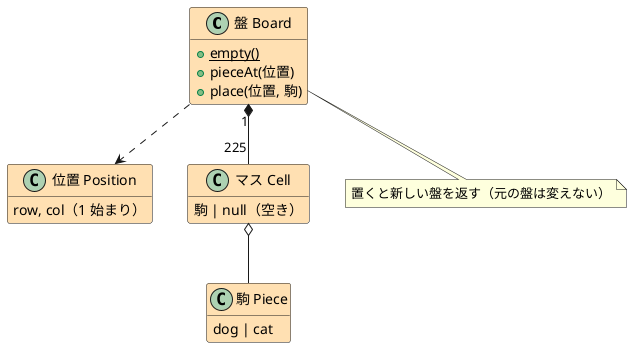
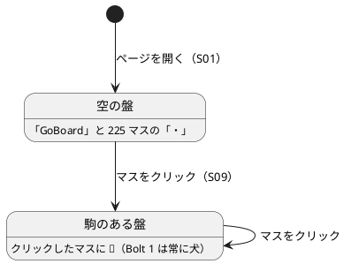

# GoBoard Bolt 1 計画（ウォーキングスケルトン）

## Bolt ゴール

ブラウザで開くと空の盤が表示され、マスを 1 つクリックすると犬の駒が表示されるところまでを、ルール（U1）から画面（U4）まで通して動かす。これで、TypeScript・React・Vitest のテストの流れがこのリポジトリで回るか、絵文字の盤がブラウザでそろうかが分かる。

## 対象

| 項目 | 内容 |
| :--- | :--- |
| Unit | U1 盤と着手・U4 Web 画面 |
| ストーリー | S01（すべて）、S02（すべて）、S09（2 つ目の受入条件のみ） |
| 入力 | [ルール定義](../../requirements/goboard/ルール定義.md)・[ユーザーストーリー](../../requirements/goboard/ユーザーストーリー.md)・[リリース計画](./release_plan.md)・[ADR 0001](../../adr/goboard/0001-TypeScriptとReactによるWebアプリにする.md) |
| 承認ゲート | 各ステップ（最初の Bolt のため） |

Bolt 1 には手番（U2）がないため、置く駒は常に犬とします。手番の交代と置けない場所の拒否は Bolt 2 で扱います。

## 設計

### 設計図（Bolt 1 の範囲）

図は Bolt 完了後に、この Bolt の範囲に絞って追加した（設計整合性の検証 B1）。色の付いた要素がこの Bolt で追加したもの。全体の図は [ドメインモデル](../../design/goboard/domain-model.md)・[UI 設計](../../design/goboard/ui-design.md) を参照。ER 図は、データベースを持たないため全 Bolt で省略する。

#### ドメインモデル図

#### 状態遷移図

この Bolt には状態を持つ対局（`Game`）がないため省略する（盤は不変の値オブジェクト）。

#### 画面遷移図

## 着手前に確認すること

- [x] 仮定 A4（`apps/goboard/` に npm パッケージを置き、`npm run dev` で起動する。ADR 0001 で Go から変更）

## ステップ

状態の記号は [リリース・イテレーション計画ガイド（AI-DLC 版）](../../reference/リリース・イテレーション計画ガイド_AI-DLC版.md) の状態ボードに従います。

- [x] 1. プロジェクト構成を作る：`apps/goboard/` に TypeScript・React・Vite・Vitest の設定と、ルール（`src/game/`、U1〜U3）と画面（`src/ui/`、U4）の置き場所を作る。※ 新規ファイル・構造変更・外部ライブラリ導入のため要確認
- [x] 2. 盤のテストを書く（Red）：新しい盤は 15 行 × 15 列で、225 マスすべてが空いている（S01）
- [x] 3. 盤を実装する（Green）→ リファクタリング
- [x] 4. 駒を置くテストを書く（Red）：空いているマスに犬を置くとそのマスが犬になり、ほかの 224 マスは変わらない（S02）
- [x] 5. 駒を置く処理を実装する（Green）→ リファクタリング
- [x] 6. 盤の画面のテストを書く（Red）：Testing Library で、「GoBoard」の名前と、225 個の空いているマス（`・`）が表示されることを確かめる（S01）
- [x] 7. 盤の画面を実装する（Green）→ リファクタリング
- [x] 8. クリックから表示までのテストを書く（Red）：8 行 8 列のマスをクリックすると、そのマスに 🐶 が表示される（S09）
- [x] 9. クリックの処理を実装する（Green）→ リファクタリング
- [x] 10. 実際のブラウザで `npm run dev` を開いて表示を確かめる：マス目がそろうか、駒が見分けられるか（リスク K1）。※ 人の確認が必要
- [x] 11. 受入条件のチェックボックスと、リリース計画の進捗を更新する

## 完了条件

- [x] S01・S02 の受入条件と、S09 の 2 つ目の受入条件が自動テストで通る
- [x] `apps/goboard/` で `npm run typecheck`・`npm test`・`npm run build` が成功する
- [x] `src/game/` が React や DOM に依存していない
- [x] ルール定義にない振る舞いを加えていない
- [x] ステップ 10 の結果をプロダクトオーナーが確認した

## 結果

| 項目 | 結果 |
| :--- | :--- |
| 自動テスト | 11 件すべて成功（ルール 6 件、画面 5 件） |
| 型チェック・ビルド | `npm run typecheck`・`npm run build` 成功 |
| 依存の向き | `src/game/` に React・DOM の import なし |
| 受け入れテスト（Bolt 1 のあとに追加） | ADR 0002 で Cucumber と Playwright を導入し、Bolt 1 で満たした受入条件（S01・S02・S09 の 1 件）の 7 シナリオがブラウザで成功 |
| ブラウザでの表示（ステップ 10） | Chromium で確認。225 マスすべてが 36 × 36 px でそろい、8 行 8 列・3 行 4 列のクリックで 🐶 が表示された。プロダクトオーナーが確認済み |

### 仮説の検証

- **TypeScript・React・Vitest のテストの流れが回るか**：回った。ルールは Vitest の単体テストで、画面は Testing Library でクリック操作から表示までを、ブラウザなしで検証できた。
- **絵文字の盤がブラウザでそろうか**：そろった。マスの大きさを CSS で固定したため、絵文字の表示幅に左右されない（リスク K1 は解消の見込み。他のブラウザ・OS での見た目は Bolt 5 で確認する）。

### 学び

- `tsc` で CSS の import を解決するには、`tsconfig.json` の `types` に `vite/client` が必要だった。
- マスの読み上げ名（例：「8 行 8 列 空き」）を付けたことで、画面のテストをマスの位置と状態で書けた。Playwright で名前を指定するときは部分一致に注意する（「3 行 4 列」が「13 行 4 列」にも一致する）。

## Bolt 1 のあとに決めること

ステップ 10 の承認ゲートで、Bolt 2 以降のゲート密度を決めます。U2（手番）はエントロピー評価がすべて LOW のため、自律実行を候補にします。

## 改訂履歴

| 日付 | 内容 |
| :--- | :--- |
| 2026-09-26 | 初版（Go の CLI として計画。ステップ 1 まで実施） |
| 2026-09-26 | ADR 0001 に合わせて TypeScript・React の Web アプリに変更。ステップ 1 を TypeScript でやり直した |
| 2026-09-26 | 設計整合性の検証（B1）を受けて、この Bolt の範囲に絞った設計図を追加 |
