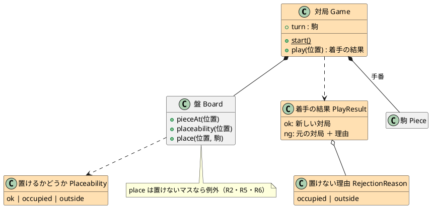
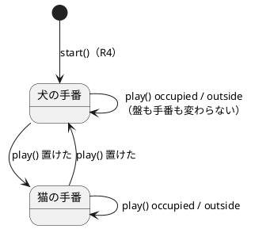
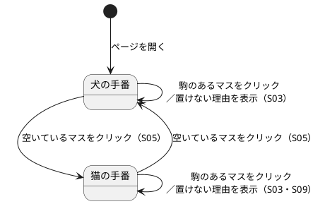

# GoBoard Bolt 2 計画（置けない場所と手番）

## Bolt ゴール

駒のあるマスと盤の外には置けないようにし、犬と猫が交互に手番を行えるようにする。画面には手番のプレイヤーと置けない理由を表示する。これで、U1（盤と着手）と U2（手番）の境界、つまり「誰が手番を持ち、置けるかを誰が判断するか」を素直に書けるかが分かる。

## 対象

| 項目 | 内容 |
| :--- | :--- |
| Unit | U1 盤と着手・U2 手番・U4 Web 画面 |
| ストーリー | S03・S04・S05、S09（残りの受入条件すべて） |
| フィーチャーファイル | `placement/s03_occupied_cell.feature`・`placement/s04_outside_board.feature`・`turn/s05_alternate_turns.feature`・`screen/s09_click_to_place.feature` |
| 承認ゲート | 自律実行（テストが失敗したとき・最終ステップだけ人が確認する）。U2 のエントロピー評価がすべて LOW で、Bolt 1 で AI の出力の質を確認できたため |

## 設計の方針

- **対局（`Game`）を U2 として追加する**：盤と手番を持ち、`play(位置)` で手番のプレイヤーの駒を置く。置けたら手番を相手に渡し、置けなければ盤も手番も変えずに理由を返す。
- **盤（`Board`）は置けるかどうかを自分で守る**：`place` は、駒のあるマスや盤の外を指定されたら例外を投げる。ルールに反する盤を作れないようにするため。置けるかどうかの問い合わせ（`placeability`）も盤が答える。
- **画面は `Game` にだけ話しかける**：手番の表示・置けない理由の表示は、`Game` の結果をそのまま表示する。
- **受け入れテストでの盤の準備**：画面のクリックで準備する。指定した駒を置くために相手の手番が必要なときは、相手の駒をシナリオと関係のない 15 行目に置く。S11（Bolt 4）のように「特に書いていないマスは空いている」を守る必要がある準備の方式は、Bolt 4 で改めて提案する。
- **盤の外（S04）**：画面からは盤の外を選べないため、S04 のシナリオはブラウザを使わず、ルール（`Game`）に対して直接検証する。

### 設計図（Bolt 2 の範囲）

図は Bolt 完了後に、この Bolt の範囲に絞って追加した（設計整合性の検証 B1）。色の付いた要素がこの Bolt で追加したもの。全体の図は [ドメインモデル](../../design/goboard/domain-model.md)・[UI 設計](../../design/goboard/ui-design.md) を参照。ER 図は、データベースを持たないため全 Bolt で省略する。

#### ドメインモデル図

#### 状態遷移図

#### 画面遷移図

## ステップ

- [x] 1. 盤の外と駒のあるマスのテストを書き、`Board` が置けるかどうかを判定し、置けないマスへの `place` を拒むようにする（S03・S04）
- [x] 2. 対局のテストを書き、`Game` を実装する：先手は犬、置くと手番が交代、置けないときは盤も手番も変わらない（S03・S04・S05）
- [x] 3. 画面のテストを書き、手番の表示・交互の着手・置けない理由の表示を実装する。パスの操作は置かない（S05・S09）
- [x] 4. S03・S04・S05・S09 のシナリオから `@wip` を外し、ステップ定義を実装する
- [x] 5. 受入条件のチェックボックス・リリース計画の進捗・本計画の結果を更新する。※ 最終ステップのため人が確認する

## 完了条件

- [x] S03・S04・S05・S09 のシナリオから `@wip` を外し、`npm run test:acceptance` が成功する
- [x] `apps/goboard/` で `npm run typecheck`・`npm test`・`npm run build` が成功する
- [x] `src/game/` が React や DOM に依存していない
- [x] ルール定義にない振る舞いを加えていない

## 結果

| 項目 | 結果 |
| :--- | :--- |
| 受け入れテスト | 24 シナリオ・137 ステップすべて成功（Bolt 1 の 7 シナリオ ＋ Bolt 2 の 17 シナリオ） |
| 単体テスト | 31 件すべて成功（ルール 20 件、画面 11 件） |
| 型チェック・ビルド | `npm run typecheck`・`npm run build` 成功 |
| 依存の向き | `src/game/` に React・DOM の import なし |
| 変異の確認 | 手番が交代しないように実装を壊すと、受け入れテストが 6 シナリオ失敗することを確認して元に戻した |

### 仮説の検証

- **U1 と U2 の境界が素直に書けるか**：書けた。盤（`Board`）は「置けるかどうか」を答え、ルールに反する盤を作らせない。対局（`Game`）は手番を持ち、置けたら交代し、置けなければ盤も手番も変えずに理由を返す。画面は `Game` の結果を表示するだけになった。

### 学び

- リファクタリング中に、盤の外の位置（例：1 行 16 列）の `pieceAt` が隣の行のマスを返す不具合を見つけた。Bolt 1 では「盤の外の扱いはテストで決めていない」として残していたもので、テストで再現してから直した。
- Cucumber の `{int},{int}` は `{float}` と曖昧になるため、位置の並びはパラメータ型（`{positions}`）で受け取る。
- 画面のクリックだけで盤を準備すると、相手の駒を置いて手番を進める必要がある。Bolt 2 では最下段に置いた。S11（Bolt 4）のように「特に書いていないマスは空いている」必要があるシナリオでは、この方式は使えない（Bolt 4 で準備の方式を提案する）。

## 改訂履歴

| 日付 | 内容 |
| :--- | :--- |
| 2026-09-26 | 設計整合性の検証（B1）を受けて、この Bolt の範囲に絞った設計図を追加 |
