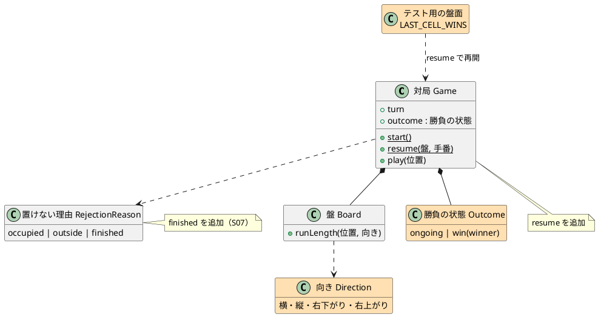
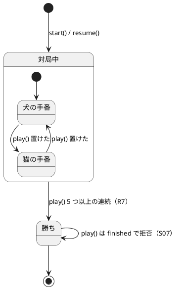
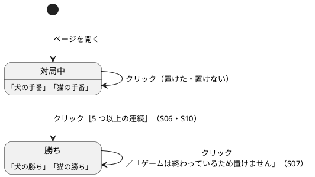

# GoBoard Bolt 3 計画（勝ち）

## Bolt ゴール

縦・横・右下がり・右上がりのどれかに、同じ種類の駒が 5 つ以上連続したら、その種類を受け持つプレイヤーの勝ちにする。勝ちが決まったらそれ以上置けず、画面に「犬の勝ち」「猫の勝ち」を表示する。これで、判定の受入テストでルール R7 を漏れなく表現できるかが分かる。

## 対象

| 項目 | 内容 |
| :--- | :--- |
| Unit | U3 勝敗判定・U4 Web 画面（連続を数える処理は U1 の盤に置く） |
| ストーリー | S06・S07・S10（勝ちの受入条件。引き分けの受入条件は Bolt 5） |
| フィーチャーファイル | `result/s06_win.feature`・`result/s07_game_over.feature`・`screen/s10_show_result.feature`（引き分けのシナリオは `@wip` のまま） |
| 承認ゲート | 自律実行（テストが失敗したとき・最終ステップだけ人が確認する） |

## 設計の方針

- **連続を数える処理を盤に置く**：`Board.runLength(位置, 向き)` は、指定したマスの駒と同じ種類の駒が、その向きの軸（前後両方向）にあいだを空けずにいくつ連続しているかを返す。R7 の判定と、Bolt 4 の R9（ちょうど 3 つ）の判定で共通に使う。
- **勝ちは置いたあとに判定する（R8）**：`Game.play` は、置いた駒を通る 4 方向のどれかで連続が 5 以上なら、その駒の種類の勝ちにする。
- **ゲームが終わったら置けない（S07）**：勝ちが決まった対局に置こうとすると、理由 `finished` で拒否し、盤は変えない。
- **途中の盤面から対局を再開できるようにする**：`Game.resume(盤, 手番)`。S07 の「最後の 1 マスで勝ち」は画面のクリックでは準備できないため、この盤面を使い、ルール（`Game`）に対して直接検証する（S04 と同じ方式）。
- **盤面のフィクスチャ**：「最後の 1 マスに犬を置くと 5 つ並ぶ、224 マスが埋まった盤」を `src/game/testing/boards.ts` に置く。この盤面は探索スクリプトで作り、「犬 112・猫 112、どちらも 5 つ並んでいない、最後の 1 マスに犬を置くと 5 つ並ぶ」ことを総当たりで確かめた。

### 設計図（Bolt 3 の範囲）

図は Bolt 完了後に、この Bolt の範囲に絞って追加した（設計整合性の検証 B1）。色の付いた要素がこの Bolt で追加したもの。全体の図は [ドメインモデル](../../design/goboard/domain-model.md)・[UI 設計](../../design/goboard/ui-design.md) を参照。ER 図は、データベースを持たないため全 Bolt で省略する。

#### ドメインモデル図

#### 状態遷移図

#### 画面遷移図

## ステップ

- [x] 1. 連続を数えるテストを書き、`Board.runLength` を実装する（4 方向、盤の端、別の種類の駒、あいだの空き）
- [x] 2. 勝ちのテストを書き、`Game` に勝敗（`outcome`）を加える：4 方向の 5 つ、6 つ以上、猫の勝ち、接しないマス、別の種類の駒、あいだの空き、盤の端（S06）
- [x] 3. 勝ったあとのテストを書き、置けないこと（`finished`）と、最後の 1 マスでの勝ちを実装する（S07）
- [x] 4. 画面のテストを書き、「犬の勝ち」「猫の勝ち」の表示と、勝ったあとのクリックの拒否を実装する（S10）
- [x] 5. S06・S07・S10（勝ち）のシナリオから `@wip` を外し、ステップ定義を実装する
- [x] 6. 受入条件のチェックボックス・リリース計画の進捗・本計画の結果を更新する。※ 最終ステップのため人が確認する

## 完了条件

- [x] S06・S07・S10（勝ち）のシナリオから `@wip` を外し、`npm run test:acceptance` が成功する
- [x] `apps/goboard/` で `npm run typecheck`・`npm test`・`npm run build` が成功する
- [x] `src/game/` が React や DOM に依存していない
- [x] ルール定義にない振る舞いを加えていない

## 結果

| 項目 | 結果 |
| :--- | :--- |
| 受け入れテスト | 40 シナリオ・241 ステップすべて成功（Bolt 3 で 16 シナリオを追加） |
| 単体テスト | 57 件すべて成功（ルール 43 件、画面 14 件） |
| 型チェック・ビルド | `npm run typecheck`・`npm run build` 成功 |
| 依存の向き | `src/game/` に React・DOM の import なし |
| 変異の確認 | 勝ちに必要な数を 6 に変えると、受け入れテストが 12 シナリオ失敗することを確認して元に戻した |
| `@wip` の残り | 19 シナリオ（S08・S11・S12、S10 の引き分け）。S11 の 7 シナリオは既存のステップで動いて失敗しており、Bolt 4 の Red になる |

### 仮説の検証

- **判定の受入テストで R7 を漏れなく表現できるか**：できた。4 方向・猫・6 つ以上・接しないマス・別の種類の駒・あいだの空き・盤の端・最後の 1 マスを、単体テストと受け入れテストの両方で表現した。連続を数える処理（`Board.runLength`）は、向きごとに前後両方向を数える 1 つの関数にまとまり、R9 でもそのまま使える。

### 学び

- 「224 マスが埋まり、最後の 1 マスで勝つ」盤面は手で作ると誤りやすい。探索スクリプトで作り、条件を総当たりで確かめてからフィクスチャにした。引き分け用の盤面（最後の 1 マスでも勝たない）も同じ方法で作れる（Bolt 5）。
- このフィクスチャは R9 を考慮していない。Bolt 4 で R9 を入れたあと、最後の 1 マスが R9 に当たらないことを確かめる。
- 勝負がついたあとは手番の表示がなくなるため、受け入れテストの「手番を読む」処理は、対局中かどうかを区別する必要があった。

## 改訂履歴

| 日付 | 内容 |
| :--- | :--- |
| 2026-09-26 | 設計整合性の検証（B1）を受けて、この Bolt の範囲に絞った設計図を追加 |
