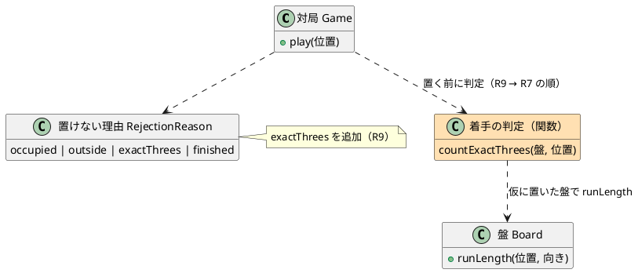
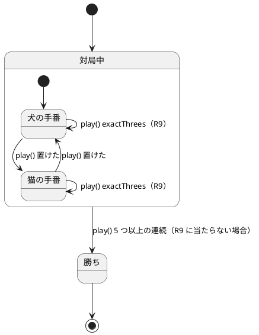
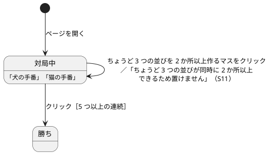

# GoBoard Bolt 4 計画（ちょうど 3 つの並び）

## Bolt ゴール

駒を置くと、同じ種類の駒の「ちょうど 3 つの並び」が同時に 2 か所以上できるマスには、置けないようにする（R9）。これで、Bolt 3 で作った「連続を数える」処理（`Board.runLength`）を、R9 の判定にそのまま再利用できるかが分かる。

## 対象

| 項目 | 内容 |
| :--- | :--- |
| Unit | U1 盤と着手・U4 Web 画面 |
| ストーリー | S11 |
| フィーチャーファイル | `placement/s11_two_exact_threes.feature` |
| 承認ゲート | 自律実行（テストが失敗したとき・最終ステップだけ人が確認する） |

## 設計の方針

- **判定の方法**：置こうとするマスに仮に駒を置き、そのマスを通る 4 方向のうち、連続の数（`runLength`）がちょうど 3 になる方向を数える。2 以上なら置けない。`runLength` は同じ種類の駒があいだを空けずに連続する最大の長さなので、「両隣に同じ種類の駒がない」「4 つ以上は含めない」「あいだが空いた並びは含めない」「相手の駒や盤の端でふさがれていても数える」「置く駒を含む並びだけを数える」が、この 1 つの数え方で満たされる。
- **判定の場所**：R9 は駒を置くときのルールで、盤の状態の不変条件ではない。そのため `Board.place` では判定せず、`Game.play` が「ゲームの終了 → 盤の外・駒のあるマス → R9 → 置く → 勝ち」の順で判定する（R9 を R7 より先に判定する）。置けなかった理由は `exactThrees` とする。
- **呼び名**：コード・ファイル名・表示には、ルール定義の言葉（ちょうど 3 つの並び）を使う。既存ゲームの用語は使わない（CLAUDE.md のガードレール）。
- **受け入れテストの盤の準備（案 A）**：S11 は「特に書いていないマスは空いている」盤を前提にするため、`Game.resume` で盤を作り、ルールに対して直接検証する。置けない理由が画面に表示されることだけは、画面のクリックで盤を準備して確かめる。フィーチャーファイルは Gherkin の「ルール」で、ルールに対する検証と画面での確認を分ける。
- **既存の盤面への影響の確認**：S07 のフィクスチャ（最後の 1 マスで勝つ盤面）と、Bolt 2・3 の画面のクリックによる盤の準備が、R9 に当たらないことを確かめる。

### 設計図（Bolt 4 の範囲）

図は Bolt 完了後に、この Bolt の範囲に絞って追加した（設計整合性の検証 B1）。色の付いた要素がこの Bolt で追加したもの。全体の図は [ドメインモデル](../../design/goboard/domain-model.md)・[UI 設計](../../design/goboard/ui-design.md) を参照。ER 図は、データベースを持たないため全 Bolt で省略する。

#### ドメインモデル図

#### 状態遷移図

#### 画面遷移図

## ステップ

- [x] 1. R9 の単体テストを書き、`Game.play` に判定を加える（S11 の受入条件 13 件）
- [x] 2. 画面のテストを書き、置けない理由（ちょうど 3 つの並び）の表示を実装する
- [x] 3. S11 のフィーチャーファイルを「ルール」で分け、`@wip` を外してステップ定義を実装する
- [x] 4. 既存の単体テスト・受け入れテスト・フィクスチャが R9 に当たらないことを確かめる
- [x] 5. 受入条件のチェックボックス・リリース計画の進捗・本計画の結果を更新し、CI の成功を確かめる。※ 最終ステップのため人が確認する

## 完了条件

- [x] S11 のシナリオから `@wip` を外し、`npm run test:acceptance` が成功する
- [x] `apps/goboard/` で `npm run typecheck`・`npm test`・`npm run build` が成功する
- [x] push したコミットで GitHub Actions の GoBoard CI が成功している
- [x] `src/game/` が React や DOM に依存していない
- [x] ルール定義にない振る舞いを加えていない

## 結果

| 項目 | 結果 |
| :--- | :--- |
| 受け入れテスト | 54 シナリオ・345 ステップすべて成功（Bolt 4 で S11 の 14 シナリオを追加） |
| 単体テスト | 71 件すべて成功（ルール 56 件、画面 15 件） |
| 型チェック・ビルド | `npm run typecheck`・`npm run build` 成功 |
| CI | GoBoard CI（コミット d87e547、実行 36230831056）が成功 |
| 依存の向き | `src/game/` に React・DOM の import なし |
| 変異の確認 | 置けなくなる並びの数を 3 に変えると、受け入れテストが 9 シナリオ失敗することを確認して元に戻した |
| 既存の盤面への影響 | S07 のフィクスチャ（最後の 1 マスで勝つ盤面）と、Bolt 2・3 の画面のクリックによる盤の準備は、R9 に当たらなかった |
| `@wip` の残り | 6 シナリオ（S08・S12、S10 の引き分け）。Bolt 5 の範囲 |

### 仮説の検証

- **`runLength` を R9 の判定に再利用できるか**：できた。「仮に置いて、置いたマスを通る 4 方向のうち連続がちょうど 3 の方向を数える」だけで、R9 の詳細（4 つ以上を含めない、あいだの空きを含めない、相手の駒や盤の端でふさがれていても数える、置く駒を含む並びだけを数える）がすべて満たされた。追加したのは 10 行ほどの関数 1 つだけだった。

### 学び

- R9 は「駒を置くときのルール」で、「盤の状態の不変条件」ではない。`Board.place` で判定すると、テストの盤面（フィクスチャ）を作ることさえできなくなるため、判定は `Game.play` に置いた。
- 同じフィーチャーファイルの中で「ルールに対する検証」と「画面での確認」を分けるには、Gherkin の「ルール」ごとに背景を持たせるのが読みやすかった。
- フィーチャーファイル名に既存ゲームの用語（double three）が入っていたのを、ルール定義の言葉（two exact threes）に改めた。ガードレールは、コードだけでなくファイル名やテスト名にも当てはまる。

## 改訂履歴

| 日付 | 内容 |
| :--- | :--- |
| 2026-09-26 | 設計整合性の検証（B1）を受けて、この Bolt の範囲に絞った設計図を追加 |
