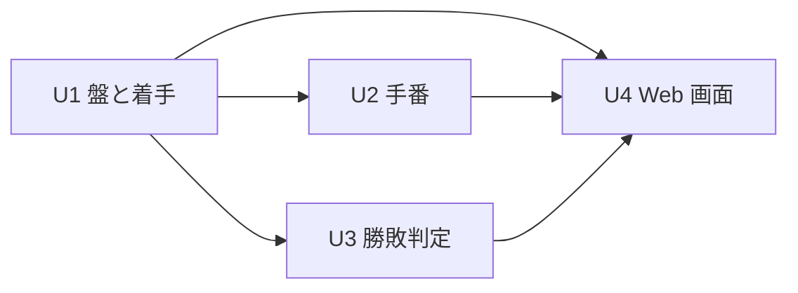
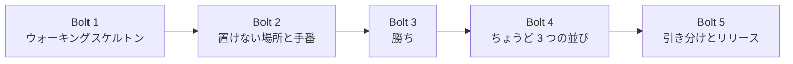

# GoBoard リリース計画

GoBoard の最初のリリース（v0.1.0）の計画です。[ルール定義](../../requirements/goboard/ルール定義.md) と [ユーザーストーリー](../../requirements/goboard/ユーザーストーリー.md) を入力に、Intent を Unit に分解し、Bolt の並びを決めます。計画の進め方は [リリース・イテレーション計画ガイド（AI-DLC 版）](../../reference/リリース・イテレーション計画ガイド_AI-DLC版.md) に従います。

## Intent

プロダクトオーナーが説明したルールどおりに動く 2 人対戦のボードゲーム「GoBoard」を作り、1 台のブラウザで 2 人が最初の手から勝敗（または引き分け）まで遊べるようにする。

## 満足条件

| 項目 | 内容 |
| :--- | :--- |
| スコープ | ストーリー S01〜S12（ルール R1〜R10 をすべて満たす） |
| 品質 | 受入条件をすべて自動テストで判定できる。ルールにない振る舞いを加えない |
| 形態 | 1 台のブラウザで人対人の Web アプリ。TypeScript・React・Vite で作る（[ADR 0001](../../adr/goboard/0001-TypeScriptとReactによるWebアプリにする.md)） |
| リリース | v0.1.0。5 Bolt で完了する |

## Unit 分解

| Unit | 責務 | ストーリー | 主なルール |
| :--- | :--- | :--- | :--- |
| U1 盤と着手 | 15 × 15 の盤、マス、駒（犬・猫）を表し、置けるマス（空いていて盤内にあり、R9 に当たらない）にだけ駒を置ける | S01・S02・S03・S04・S11 | R2・R3・R5・R6・R9 |
| U2 手番 | 先手を犬とし、駒を置くたびに手番を交互に進める。パスはない | S05 | R4・R5 |
| U3 勝敗判定 | 置いたあとに 5 つ以上の連続（縦・横・斜め）、盤の埋まり、次の手番のプレイヤーが置けるマスの有無を判定し、ゲームを終える | S06・S07・S08・S12 | R7・R8・R10 |
| U4 Web 画面 | 盤と手番・結果をブラウザに表示し、マスのクリックを受け取って U1〜U3 に渡す | S01・S09・S10 | R1・R5 |

U1〜U3 はゲームのルール（ドメイン）で、`apps/goboard/src/game/` に置き、React や DOM に依存しません。U4 だけが画面を扱い（`apps/goboard/src/ui/`）、ルールは U1〜U3 に問い合わせます。これにより、ルールの変更が画面の再設計を要求せず、表示の変更がルールに影響しません。

### 依存関係

U2 と U3 は互いに依存しないため、U1 が揃えば並列に進められます。

## 実装エントロピー評価

| Unit | 意図の曖昧さ | 構造的不確実性 | 検証の不確実性 | リスク | 未解決の仮定 | 承認ゲート |
| :--- | :--- | :--- | :--- | :--- | :--- | :--- |
| U1 盤と着手 | LOW | LOW | MED | LOW | LOW | 各ステップ（R9 を含むため） |
| U2 手番 | LOW | LOW | LOW | LOW | LOW | 自律実行 |
| U3 勝敗判定 | LOW | LOW | MED | LOW | LOW | 各ステップ |
| U4 Web 画面 | LOW | MED | MED | LOW | MED | 各ステップ |

- **U1 の検証の不確実性が MED**：R9 の「ちょうど 3 つ」の判定には、4 方向・置く駒が並びの端か真ん中か・4 つ以上・あいだの空き・相手の駒・盤の端・R7 との順番といった境界が多く、受入テストの組み合わせでしか網羅を確かめられないため。構造的不確実性は Bolt 1 で構成が固まったので LOW に下げた。
- **U3 の検証の不確実性が MED**：判定の抜け（斜め 2 方向、盤の端、6 つ以上、あいだの空き）は、テストの組み合わせでしか網羅を確かめられないため。受入テストを先に書きます。
- **U4 が MED**：React の画面をテストで検証する流れ（Testing Library）がこのリポジトリで初めてであり、再読み込み時の扱い（仮定 A2）が未確認のため。

## スコープ・深さ・テスト戦略

| 軸 | 選択 | 理由 |
| :--- | :--- | :--- |
| スコープ | 全ステージ | 新しいプロダクトのため |
| 深さ | Standard | 学習目的のハンズオンだが、ルールの正しさを契約として検証したい |
| テスト戦略 | Standard | ドメイン（U1〜U3）は受入条件ごとに Vitest で単体テストを書く。U4 は Testing Library でクリック操作から表示までを通すテストを書く。ストーリーの受入条件は日本語 Gherkin のシナリオにし、Cucumber と Playwright でブラウザから検証する（[ADR 0002](../../adr/goboard/0002-CucumberとPlaywrightで受け入れテストを書く.md)） |

## Bolt 計画

| Bolt | ゴール | Unit | ストーリー | 確認したい仮説 |
| :--- | :--- | :--- | :--- | :--- |
| Bolt 1 | ウォーキングスケルトン：ブラウザで開くと空の盤が表示され、マスを 1 つクリックすると犬の駒が表示される | U1・U4 | S01・S02・S09（最小） | TypeScript・React・Vitest のテストの流れが回るか。絵文字の盤がブラウザでそろうか |
| Bolt 2 | 置けない場所と手番：駒のあるマス・盤の外を拒み、犬と猫が交互に置ける | U1・U2・U4 | S03・S04・S05・S09 | U1 と U2 の境界（誰が手番を持つか）が素直に書けるか |
| Bolt 3 | 勝ち：縦・横・斜めに 5 つ以上並べたら勝ち、ゲームが終わって結果が表示される | U3・U4 | S06・S07・S10（勝ち） | 判定の受入テストで、ルール R7 を漏れなく表現できるか |
| Bolt 4 | ちょうど 3 つの並び：ちょうど 3 つの並びを 2 か所以上作るマスには置けない | U1・U4 | S11 | Bolt 3 で作る「連続した駒を数える」処理を、R9 の判定に再利用できるか |
| Bolt 5 | 引き分けとリリース：盤が埋まったとき、置けるマスがなくなったときに引き分けになり、v0.1.0 として通しで遊べる | U3・U4 | S08・S12・S10（引き分け） | 最初から最後まで遊んだとき、ルールにない振る舞いが残っていないか |

U2 と U3 は並列に進められますが、担当は 1 つのモブのため、Bolt は順番に回します。

### Bolt 共通の完了条件（Definition of Done）

- [ ] Bolt に含めたストーリーのシナリオから `@wip` を外し、`npm run test:acceptance` が成功する
- [ ] Bolt に含めたストーリーの受入条件が、すべて自動テストで通っている
- [ ] `apps/goboard/` で `npm run typecheck`・`npm test`・`npm run build` が成功する
- [ ] push したコミットで GitHub Actions の GoBoard CI が成功している
- [ ] ルール定義にない振る舞いを加えていない
- [ ] プロダクトオーナーが承認ゲートでコードと動作を確認した
- [ ] ストーリーの受入条件のチェックボックスと本計画の進捗を更新した

### Bolt ごとの詳細計画

| Bolt | 詳細計画 | 状態 |
| :--- | :--- | :--- |
| Bolt 1 | [bolt_1_plan.md](./bolt_1_plan.md) | 完了 |
| Bolt 2 | [bolt_2_plan.md](./bolt_2_plan.md) | 完了 |
| Bolt 3 | [bolt_3_plan.md](./bolt_3_plan.md) | 完了 |
| Bolt 4 | Bolt 3 完了時に作成する | 未着手 |
| Bolt 5 | Bolt 4 完了時に作成する | 未着手 |

## リスク台帳

| ID | リスク | 対策 | 承認ゲート |
| :--- | :--- | :--- | :--- |
| K1 | 絵文字（🐶・🐱）の見た目がブラウザや OS のフォントによって異なる | マスの大きさを CSS で固定した（Bolt 1 で Chromium のマス目がそろうことを確認済み）。他のブラウザでの見た目は Bolt 5 で確認する | Bolt 5 |
| K2 | 一般名称のゲームの知識が、ルール定義にない振る舞い（禁じ手など）として紛れ込む | 受入条件をルール番号にトレースする。レビューで「このコードはどのルールに由来するか」を確認する | 各 Bolt の完了時 |
| K3 | 仮定（A2・A3）がプロダクトオーナーの期待と違う | 仮定を明示し、該当する Bolt の着手前に確認する | 各 Bolt の着手前 |
| K4 | 外部ライブラリ（React・Vite・Vitest・Cucumber・Playwright など）の更新で動かなくなる | `package-lock.json` でバージョンを固定する。更新は `npm outdated` で確認し、テストが通ることを確かめてから行う | 依存を更新するとき |
| K5 | R9 の判定漏れや誤判定で、置けるはずのマスに置けない（または逆） | S11 の受入条件 13 件を先にテストにする。R9 の判定は U1 の 1 か所に閉じ込める | Bolt 4 の各ステップ |
| K6 | 受入条件がユーザーストーリーの文書とフィーチャーファイルで食い違う | 受入条件を変えるときは両方を同じコミットで更新する。フィーチャーファイルのタグ（`@S01` など）で対応を追えるようにする | 各 Bolt の完了時 |

外部サービス・認証・データベース・サーバーは扱わないため、それらに関するリスクはありません。

## 未確認の仮定

| ID | 仮定 | 確認のタイミング |
| :--- | :--- | :--- |
| A1 | 座標は「行 列」の順に 1〜15 の数字を半角スペースで区切って入力する | 廃止（Web 画面ではマスをクリックするため。ADR 0001） |
| A2 | ページを再読み込みすると、対局は最初からやり直しになる（対局の状態を保存しない） | 確認済み（Bolt 1 完了時にプロダクトオーナーが承認） |
| A3 | もう 1 局続けて遊ぶ機能は v0.1.0 に含めない | Bolt 5 の着手前 |
| A4 | アプリケーションは `apps/goboard/` に npm パッケージとして置き、`apps/goboard/` で `npm run dev` を実行して起動する | 確認済み（ADR 0001 で Go から変更） |

## 進捗

| Bolt | 状態 | 完了ストーリー |
| :--- | :--- | :--- |
| Bolt 1 | 完了 | S01・S02 完了、S09 の一部（クリックで犬を置く） |
| Bolt 2 | 完了 | S03・S04・S05 完了、S09 完了 |
| Bolt 3 | 完了 | S06・S07 完了、S10 の勝ち |
| Bolt 4 | 未着手 | - |
| Bolt 5 | 未着手 | - |
| **合計** | **3 / 5 Bolt** | **8 / 12 ストーリー（S10 は引き分けを除く）** |

## 改訂履歴

| 日付 | 内容 |
| :--- | :--- |
| 2026-09-26 | 初版（Go の CLI アプリとして計画） |
| 2026-09-26 | プロダクトオーナーの指示で、TypeScript・React による 1 台のブラウザで遊ぶ Web アプリに変更（ADR 0001）。U4 を Web 画面に変え、仮定 A1 を廃止、A2・A4 を変更、リスク K4 を追加 |
| 2026-09-26 | Bolt 1 完了。ルール R9・R10 の追加（ルール定義 v1.2）を受けて、S11・S12 と Bolt 4（ちょうど 3 つの並び）を追加し、引き分けとリリースを Bolt 5 に移した。仮定 A2 を確認済みに更新 |
| 2026-09-26 | プロダクトオーナーの指示で、受入条件を日本語 Gherkin にし、Cucumber と Playwright の受け入れテストを導入（ADR 0002）。完了条件に受け入れテストを加え、リスク K6 を追加 |
| 2026-09-26 | Bolt 2 完了（S03・S04・S05・S09）。進捗を 2 / 5 Bolt、6 / 12 ストーリーに更新 |
| 2026-09-26 | Bolt 3 完了（S06・S07、S10 の勝ち）。進捗を 3 / 5 Bolt に更新 |
| 2026-09-26 | 受け入れテストが手元の既定の実行で失敗していた（Playwright の版と Chromium の版のずれ）。Playwright を 1.56.1 に固定し、GitHub Actions の GoBoard CI を追加。完了条件に CI の成功を加えた |
| 2026-09-26 | Bolt 3 の最終確認を反映。Bolt 4（S11）の盤の準備は、ルール（`Game.resume`）に対して直接検証する方式（案 A）で進める |
