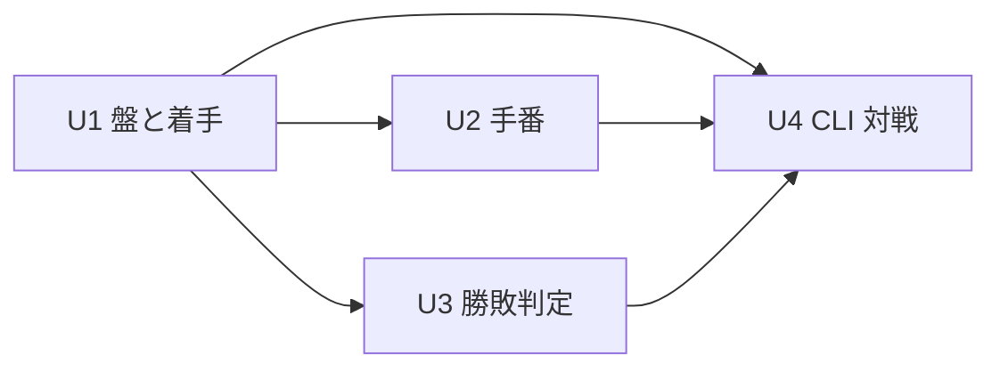
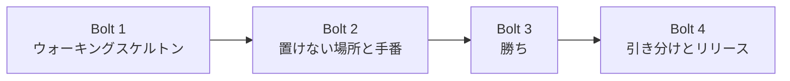

# GoBoard リリース計画

GoBoard の最初のリリース（v0.1.0）の計画です。[ルール定義](../../requirements/goboard/ルール定義.md) と [ユーザーストーリー](../../requirements/goboard/ユーザーストーリー.md) を入力に、Intent を Unit に分解し、Bolt の並びを決めます。計画の進め方は [リリース・イテレーション計画ガイド（AI-DLC 版）](../../reference/リリース・イテレーション計画ガイド_AI-DLC版.md) に従います。

## Intent

プロダクトオーナーが説明したルールどおりに動く 2 人対戦のボードゲーム「GoBoard」を作り、同じ端末で 2 人が最初の手から勝敗（または引き分け）まで遊べるようにする。

## 満足条件

| 項目 | 内容 |
| :--- | :--- |
| スコープ | ストーリー S01〜S10（ルール R1〜R8 をすべて満たす） |
| 品質 | 受入条件をすべて自動テストで判定できる。ルールにない振る舞いを加えない |
| 形態 | CLI（ターミナル）で人対人。Go の標準ライブラリだけで作る |
| リリース | v0.1.0。4 Bolt で完了する |

## Unit 分解

| Unit | 責務 | ストーリー | 主なルール |
| :--- | :--- | :--- | :--- |
| U1 盤と着手 | 15 × 15 の盤、マス、駒（犬・猫）を表し、空いている盤内のマスにだけ駒を置ける | S01・S02・S03・S04 | R2・R3・R5・R6 |
| U2 手番 | 先手を犬とし、駒を置くたびに手番を交互に進める。パスはない | S05 | R4・R5 |
| U3 勝敗判定 | 置いたあとに 5 つ以上の連続（縦・横・斜め）と盤の埋まりを判定し、ゲームを終える | S06・S07・S08 | R7・R8 |
| U4 CLI 対戦 | 盤と手番・結果を表示し、座標の入力を受け取って U1〜U3 に渡す | S01・S09・S10 | R1・R5 |

U1〜U3 はゲームのルール（ドメイン）で、画面や入出力に依存しません。U4 だけが入出力を扱い、ルールは U1〜U3 に問い合わせます。これにより、ルールの変更が画面の再設計を要求せず、表示の変更（絵文字から漢字への切り替えなど）がルールに影響しません。

### 依存関係

U2 と U3 は互いに依存しないため、U1 が揃えば並列に進められます。

## 実装エントロピー評価

| Unit | 意図の曖昧さ | 構造的不確実性 | 検証の不確実性 | リスク | 未解決の仮定 | 承認ゲート |
| :--- | :--- | :--- | :--- | :--- | :--- | :--- |
| U1 盤と着手 | LOW | MED | LOW | LOW | LOW | 各ステップ（最初の Bolt のため） |
| U2 手番 | LOW | LOW | LOW | LOW | LOW | 自律実行 |
| U3 勝敗判定 | LOW | LOW | MED | LOW | LOW | 各ステップ |
| U4 CLI 対戦 | MED | MED | MED | MED | MED | 各ステップ |

- **U1 の構造的不確実性が MED**：`apps/` が空で、Go のモジュール構成が未定のため。
- **U3 の検証の不確実性が MED**：判定の抜け（斜め 2 方向、盤の端、6 つ以上、あいだの空き）は、テストの組み合わせでしか網羅を確かめられないため。受入テストを先に書きます。
- **U4 が MED**：入力形式が未確認の仮定（A1・A2）であり、絵文字の表示幅が端末に依存するため（リスク K1）。

## スコープ・深さ・テスト戦略

| 軸 | 選択 | 理由 |
| :--- | :--- | :--- |
| スコープ | 全ステージ | 新しいプロダクトのため |
| 深さ | Standard | 学習目的のハンズオンだが、ルールの正しさを契約として検証したい |
| テスト戦略 | Standard | ドメイン（U1〜U3）は受入条件ごとに単体テストを書く。U4 は入出力を差し替えて、起動から結果表示までを通すテストを書く |

## Bolt 計画

| Bolt | ゴール | Unit | ストーリー | 確認したい仮説 |
| :--- | :--- | :--- | :--- | :--- |
| Bolt 1 | ウォーキングスケルトン：起動すると空の盤が表示され、座標を 1 つ入力すると犬の駒が置かれた盤が表示される | U1・U4 | S01・S02・S09（最小） | Go のモジュール構成とテストの流れが回るか。絵文字の盤がターミナルでそろうか |
| Bolt 2 | 置けない場所と手番：駒のあるマス・盤の外・不正な入力を拒み、犬と猫が交互に置ける | U1・U2・U4 | S03・S04・S05・S09 | U1 と U2 の境界（誰が手番を持つか）が素直に書けるか |
| Bolt 3 | 勝ち：縦・横・斜めに 5 つ以上並べたら勝ち、ゲームが終わって結果が表示される | U3・U4 | S06・S07・S10（勝ち） | 判定の受入テストで、ルール R7 を漏れなく表現できるか |
| Bolt 4 | 引き分けとリリース：盤が埋まったら引き分けになり、v0.1.0 として通しで遊べる | U3・U4 | S08・S10（引き分け） | 最初から最後まで遊んだとき、ルールにない振る舞いが残っていないか |

U2 と U3 は並列に進められますが、担当は 1 つのモブのため、Bolt は順番に回します。

### Bolt 共通の完了条件（Definition of Done）

- [ ] Bolt に含めたストーリーの受入条件が、すべて自動テストで通っている
- [ ] `apps/goboard/` で `go test ./...` と `go vet ./...` が成功する
- [ ] ルール定義にない振る舞いを加えていない
- [ ] プロダクトオーナーが承認ゲートでコードと動作を確認した
- [ ] ストーリーの受入条件のチェックボックスと本計画の進捗を更新した

### Bolt ごとの詳細計画

| Bolt | 詳細計画 | 状態 |
| :--- | :--- | :--- |
| Bolt 1 | [bolt_1_plan.md](./bolt_1_plan.md) | 承認済み・実行中 |
| Bolt 2 | Bolt 1 完了時に作成する | 未着手 |
| Bolt 3 | Bolt 2 完了時に作成する | 未着手 |
| Bolt 4 | Bolt 3 完了時に作成する | 未着手 |

## リスク台帳

| ID | リスク | 対策 | 承認ゲート |
| :--- | :--- | :--- | :--- |
| K1 | 絵文字（🐶・🐱）の表示幅が端末によって異なり、盤のマス目がそろわない | 表示を U4 の 1 か所に閉じ込め、漢字表示へ切り替えられるようにする。Bolt 1 で実際の表示を確認する | Bolt 1 の最終ステップ |
| K2 | 一般名称のゲームの知識が、ルール定義にない振る舞い（禁じ手など）として紛れ込む | 受入条件をルール番号にトレースする。レビューで「このコードはどのルールに由来するか」を確認する | 各 Bolt の完了時 |
| K3 | 入力形式の仮定（A1・A2・A3）がプロダクトオーナーの期待と違う | 仮定を明示し、Bolt 1 の着手前に確認する | Bolt 1 の着手前 |

外部サービス・認証・データベース・本番環境は扱わないため、それらに関するリスクはありません。

## 未確認の仮定

| ID | 仮定 | 確認のタイミング |
| :--- | :--- | :--- |
| A1 | 座標は「行 列」の順に 1〜15 の数字を半角スペースで区切って入力する | 確認済み（Bolt 1 の着手前にプロダクトオーナーが承認） |
| A2 | EOF（Ctrl+D）や中断（Ctrl+C）で、結果を決めずにプログラムを終える | Bolt 2 の着手前 |
| A3 | もう 1 局続けて遊ぶ機能は v0.1.0 に含めない | Bolt 4 の着手前 |
| A4 | アプリケーションは `apps/goboard/` に Go モジュールとして置き、`apps/goboard/` で `go run ./cmd/goboard` を実行して起動する | 確認済み（Bolt 1 の着手前にプロダクトオーナーが承認） |

## 進捗

| Bolt | 状態 | 完了ストーリー |
| :--- | :--- | :--- |
| Bolt 1 | 実行中 | - |
| Bolt 2 | 未着手 | - |
| Bolt 3 | 未着手 | - |
| Bolt 4 | 未着手 | - |
| **合計** | **0 / 4 Bolt** | **0 / 10 ストーリー** |
