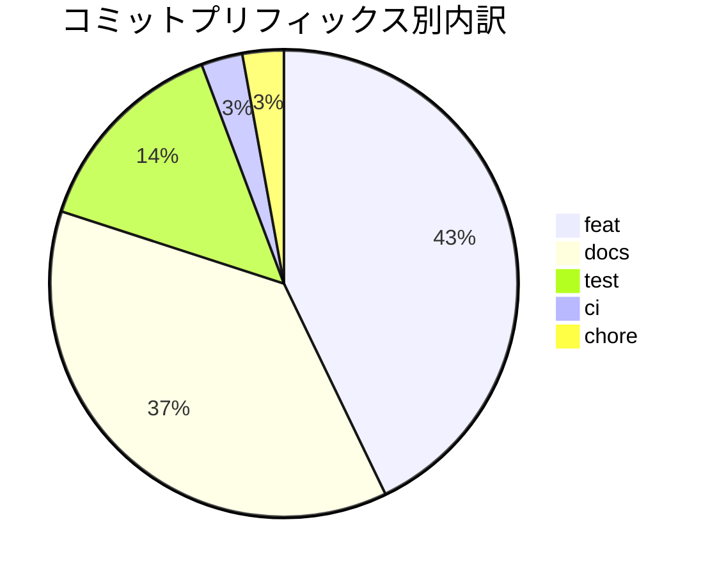

# リリース完了報告書 v0.1.0 - GoBoard

## 概要

GoBoard v0.1.0 は最初のリリースです。1 台のブラウザで 2 人が犬と猫の駒を交互に置き、最初の手から勝ち・引き分けまで通して遊べます。プロダクトオーナーが説明・承認したルール R1〜R10 と、ユーザーストーリー S01〜S12 をすべて満たし、受入条件はすべて日本語 Gherkin の受け入れテストとして成功しています。

| 項目 | 内容 |
| :--- | :--- |
| バージョン | v0.1.0（`apps/goboard/package.json`） |
| タグ | `v0.1.0` |
| 開発期間 | 2026-09-26（1 日。Intent の表明から約 2 時間） |
| 方法論 | AI-DLC（Intent → Unit → Bolt。XP の TDD を AI が回し、人が承認ゲートで検証） |
| 変更内容 | [CHANGELOG](../../../apps/goboard/CHANGELOG.md) |

## プロジェクトサマリー

| 項目 | 内容 |
| :--- | :--- |
| Intent | プロダクトオーナーが説明したルールどおりに動く 2 人対戦のボードゲームを作る |
| ルール | R1〜R10（[ルール定義](../../requirements/goboard/ルール定義.md) v1.2。R1・R3・R7 の骨子・R9 はプロダクトオーナーの指定、ほかは AI の案をプロダクトオーナーが承認） |
| ストーリー | S01〜S12（[ユーザーストーリー](../../requirements/goboard/ユーザーストーリー.md)） |
| Unit | U1 盤と着手・U2 手番・U3 勝敗判定・U4 Web 画面 |
| 形態 | TypeScript・React・Vite の Web アプリ（[ADR 0001](../../adr/goboard/0001-TypeScriptとReactによるWebアプリにする.md)） |
| 受け入れテスト | 日本語 Gherkin・Cucumber・Playwright（[ADR 0002](../../adr/goboard/0002-CucumberとPlaywrightで受け入れテストを書く.md)） |

## 計画と実績の差異分析

### Bolt 別達成状況

AI-DLC ではストーリーポイントの代わりに、完了 Unit・完了ストーリー・承認ゲートの通過で進捗を測ります。

| Bolt | ゴール | 計画したストーリー | 完了したストーリー | 状態 |
| :--- | :--- | :--- | :--- | :--- |
| [Bolt 1](./bolt_1_plan.md) | ウォーキングスケルトン | S01・S02・S09（一部） | S01・S02・S09（一部） | 完了 |
| [Bolt 2](./bolt_2_plan.md) | 置けない場所と手番 | S03・S04・S05・S09 | S03・S04・S05・S09 | 完了 |
| [Bolt 3](./bolt_3_plan.md) | 勝ち | S06・S07・S10（勝ち） | S06・S07・S10（勝ち） | 完了 |
| [Bolt 4](./bolt_4_plan.md) | ちょうど 3 つの並び | S11 | S11 | 完了 |
| [Bolt 5](./bolt_5_plan.md) | 引き分けとリリース | S08・S12・S10（引き分け） | S08・S12・S10（引き分け） | 完了 |
| **合計** | | **12 ストーリー** | **12 ストーリー（100%）** | **5 / 5 Bolt** |

### 計画からの主な変更

| 時期 | 変更 | 理由 | 記録 |
| :--- | :--- | :--- | :--- |
| Bolt 1 ステップ 1 のあと | Go の CLI から、TypeScript・React の Web アプリに変更 | プロダクトオーナーの指示（ユーザーインターフェースまで一貫した Web アプリにする） | ADR 0001 |
| Bolt 1 のあと | ルール R9（ちょうど 3 つの並びを 2 か所以上作るマスには置けない）と R10 を追加し、Bolt を 4 から 5 に増やした | プロダクトオーナーのルール追加 | ルール定義 v1.2 |
| Bolt 1 のあと | 受入条件を日本語 Gherkin にし、Cucumber と Playwright の受け入れテストを導入 | プロダクトオーナーの指示（BDD 導入ガイドに従う） | ADR 0002 |
| Bolt 3 のあと | Playwright を 1.56.1 に固定し、GitHub Actions の CI を追加 | 受け入れテストが既定の実行で失敗していた（Playwright と Chromium の版のずれ） | ADR 0002 |

## 計画日程 vs 実績日数の差異分析

計画は Bolt 単位（時間〜日）で立て、すべての Bolt を 2026-09-26 の 1 日で完了しました。プロジェクトに関わる最初のコミット（ルール定義 v1.0、07:44 UTC）からリリースのタグ（09:34 UTC 時点のコミット）まで約 1 時間 50 分です。

工期が短かった要因は次のとおりです。

- ルールを先に番号付きで確定し（R1〜R10）、受入条件をルール番号にトレースしたため、実装の判断で迷う場面がほとんどなかった。
- Bolt 1 をウォーキングスケルトンにし、以降の Bolt は自律実行（テスト失敗時と最終ステップだけ人が確認）に切り替えた。
- 連続を数える処理（`Board.runLength`）を Bolt 3 で作り、Bolt 4 の R9 と Bolt 5 の R10 にそのまま再利用できた。

## コミットログ分析

### コミットプリフィックス別内訳

対象はルール定義 v1.0 のコミットから、タグ `v0.1.0` までの 35 コミットです。

| プリフィックス | 件数 | 割合 |
| :--- | ---: | ---: |
| feat | 15 | 43% |
| docs | 13 | 37% |
| test | 5 | 14% |
| ci | 1 | 3% |
| chore | 1 | 3% |
| **合計** | **35** | **100%** |

### 分析

- `docs` が 4 割近くを占める。ルール定義・ストーリー・計画・ADR・Bolt の結果を、成果物として永続化し次のステップの入力にする AI-DLC の進め方が表れている。
- `test` のコミットは、各 Bolt でフィーチャーファイルの `@wip` を外し、ステップ定義を実装したもの。`feat` のコミットも、すべてテストを先に書いて失敗を確認してから実装している。
- バグ修正の `fix` はない。見つかった不具合（盤の外の `pieceAt` が隣の行のマスを返す）は、Bolt 2 の `feat` のコミットの中で、テストで再現してから直した。

## 品質メトリクス

### テスト数の Bolt 別推移

| Bolt | 単体テスト（Vitest） | 受け入れテスト（シナリオ） | `@wip` の残り |
| :--- | ---: | ---: | ---: |
| Bolt 1 | 11 | 7 | 52 |
| Bolt 2 | 31 | 24 | 35 |
| Bolt 3 | 57 | 40 | 19 |
| Bolt 4 | 71 | 54 | 6 |
| Bolt 5 | 79 | 60 | 0 |

### テストとコードの規模

| 項目 | 行数 |
| :--- | ---: |
| アプリケーションのコード（`src/`、テスト用を除く） | 381 |
| 単体テスト（`src/**/*.test.ts(x)`） | 721 |
| フィーチャーファイル（12 ファイル） | 500 |
| ステップ定義とサポートコード（`features/**/*.ts`） | 625 |

### テストの有効性の確認

各 Bolt で実装を意図的に壊し、受け入れテストが失敗することを確かめてから元に戻した。

| Bolt | 壊した内容 | 失敗したシナリオ |
| :--- | :--- | ---: |
| Bolt 1 | 犬の表示を別の絵文字に変える | 1 |
| Bolt 2 | 手番が交代しないようにする | 6 |
| Bolt 3 | 勝ちに必要な数を 6 にする | 12 |
| Bolt 4 | 置けなくなる並びの数を 3 にする | 9 |
| Bolt 5 | 引き分けを判定しないようにする | 4 |

### テストカバレッジ・静的解析

- カバレッジは計測していない（計測ツールを導入していない）。受入条件はすべてシナリオとして成功している。
- 静的解析は TypeScript の `strict`（`noUncheckedIndexedAccess` を含む）による型チェックだけ。ESLint は導入していない。

### CI

GitHub Actions の GoBoard CI（型チェック → 単体テスト → ビルド → 受け入れテスト）は、Bolt 3 のあとの導入以降、コードを変更したすべての push で成功している。v0.1.0 の最後のコード変更（`f96b27a`）の実行も成功。

## リリース履歴

| バージョン | 日付 | 内容 |
| :--- | :--- | :--- |
| v0.1.0 | 2026-09-26 | 最初のリリース（R1〜R10、S01〜S12） |

## 主要な成果物

### 実装した主要機能

- 15 × 15 の盤と、犬（🐶）と猫（🐱）の駒。先手は犬で、置くたびに手番が交代する（パスなし）
- 駒のあるマス・盤の外・ちょうど 3 つの並びを 2 か所以上作るマスには置けず、理由を表示する
- 縦・横・斜めに 5 つ以上並べたら勝ち。盤が埋まるか、置けるマスがなくなったら引き分け
- 勝負がついたら結果を表示し、それ以上は置けない

### 技術的成果

- ルール（`src/game/`）は React や DOM に依存せず、画面（`src/ui/`）はルールの結果を表示するだけの構成を、5 つの Bolt を通して保った。
- 受入条件を日本語 Gherkin で書き、ルールに対する検証と画面での確認を Gherkin の「ルール」で分けた。
- 画面のクリックでは準備しにくい盤面（最後の 1 マスで勝つ、置けるマスがなくなる）は、探索スクリプトで作り、条件を総当たりで確かめてからフィクスチャにした。

## 総評

### ハイライト

- ルールは、プロダクトオーナーの説明と承認だけを正解とし、既存ゲームの一般的なルールで空白を埋めなかった。途中で見つけた既存ゲームの用語（フィーチャーファイル名の「double three」）も、ルール定義の言葉に改めた。
- 受入条件 12 ストーリー分を、すべて自動の受け入れテストで検証できる状態でリリースした。

### 反省と次のリリースへの知見

- 受け入れテストを、開発環境の中だけで通る設定（ブラウザの場所を環境変数で指定）で「成功」と報告し、プロダクトオーナーの手元の既定の実行では失敗していた。以降は、`npm ci` からの実行と CI の成功を完了条件にした。
- 人の最終確認を目標の完了条件に含めると、確認を待つ間に自動の継続（Stop フック）が同じ応答を繰り返した。Bolt 5 からは、Bolt の完了を実装・テスト・CI までとし、人の確認はリリース判断として分けた。
- 他のブラウザ（Firefox・Safari）での見た目（リスク K1）は、開発環境に Chromium しかなく未確認。

### プロジェクト完了メトリクス

| 項目 | 値 |
| :--- | ---: |
| ルール | 10 |
| ストーリー（完了 / 計画） | 12 / 12 |
| Bolt（完了 / 計画） | 5 / 5 |
| 受け入れテスト（シナリオ / ステップ） | 60 / 379 |
| 単体テスト | 79 |
| ADR | 2 |
| コミット | 35 |
